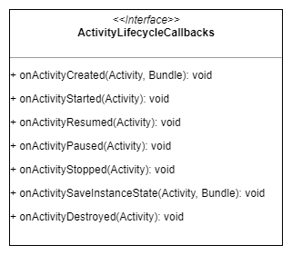
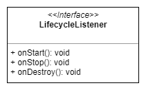
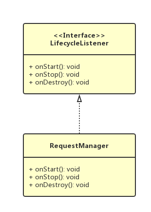
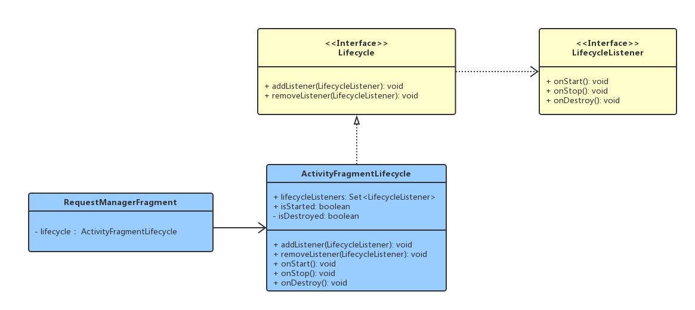
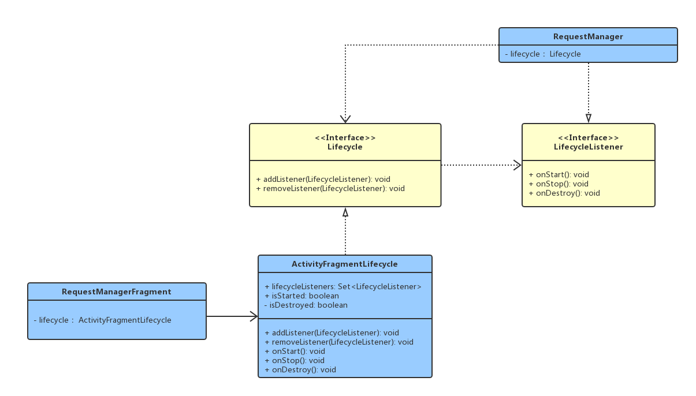

## 做一个小东西
我们需要监听Activity的生命周期，一般会选择实现ActivityLifecycleCallbacks。



这是一个比较常用的做法，但是今天我们需要另辟蹊径：
```
在Activity里面添加一个没有界面的Frgment，因为Fragment是跟随activity的生命周期的，所以利用这个Fragment，就能反向推断出Activity的生命周期。
```
写好demo，打印出log，来看看他们的生命周期：
```consolesd
E/test: Activity - onCreate: d
E/test: Fragment - onAttach: 
E/test: Fragment - onCreate: 
E/test: Fragment - onCreateView: 
E/test: Fragment - onActivityCreated: 
E/test: Activity - onStart: 
E/test: Fragment - onStart: 
E/test: Activity - onResume: 
E/test: Fragment - onResume: 
E/test: Fragment - onPause: 
E/test: Activity - onPause: 
E/test: Fragment - onStop: 
E/test: Activity - onStop: 
E/test: Fragment - onDestroyView: 
E/test: Fragment - onDestroy: 
E/test: Fragment - onDetach: 
E/test: Activity - onDestroy: 
```
这里的生命周期比较多，但是我们只需要其中的一部分。想想我们平时做网络请求，通常是在onCreate中发送，在onDestory中取消，网络框架做的更细致一点的话，在onStop中暂停请求，在onStart中恢复请求。所以我们只需要关注几个对我们来说重要的生命周期。这些生命周期是Activity与Fragment都有的，并且是几乎同时执行的，只有这样，才能根据Fragment的生命周期推断出Activity的生命周期。分析log信息，得到如下图:


## 定义监听接口
这个流程还是非常符合我们期望的，接下来我们定义一个监听接口，用客户端监听生命周期变化通知。这里我们还要考虑一个问题，如果是我们自己做网络请求，真正需要使用到的是哪些生命周期？？？大家可以好好想一想，因为我比较笨，我就直接看Glide的源码，看它使用哪几个生命周期。源码我就不上了，我还是上UML图吧，因为发现画UML图有助于我理顺类之间的关系。



看到Glide只是用了三个生命周期，onStart用来恢复请求，onStop用来暂停请求，onDestroy用来取消请求。要问我怎么知道的，点击看LifecycleListener的实现类，有一个RequestManager的类，从名字上就是与请求相关，既然我们要探寻Glide是如何做到根据页面的生命周期管理请求的，自然就要找与请求相关的类。
先看部分源码：
```java
  /**
   * Lifecycle callback that registers for connectivity events (if the
   * android.permission.ACCESS_NETWORK_STATE permission is present) and restarts failed or paused
   * requests.
   */
  @Override
  public void onStart() {
    resumeRequests();
    targetTracker.onStart();
  }
```
我们暂时先不去跟踪方法的细节，我们先认为 resumeRequests()方法能够做到恢复所有请求。所以这里代码逻辑就很清晰了，onStart就是用来恢复请求的。onStop 与 onDestroy 类似。

再看UML图：




## 管理监听
Fragment是跟随Activity的生命周期的，所以生命周期的发送者肯定Fragment是当仁不让了。由于请求肯定会有多个，所以我们需要一个集合来管理。要是我们自己来编写代码的话，肯定就是在Fragment里面搞一个集合，然后就直接开始写代码了。但是既然我们是探究Glide的源码实现，来都来了，就顺便看一下大佬是怎么做的。

我们顺着Glide.with()找到 RequestManagerFragment（与它对应的还有一个SupportRequestManagerFragment），这个framgnt就是Glide要添加到页面上的，我们看到它有一个叫做 ActivityFragmentLifecycle 的变量。看类图来理清他们的关系：



可以看到，ActivityFragmentLifecyle只是做了管理所有监听的操作。那么为啥要这样做呢，虽然我说不出一个花来，但是还是略懂一二。首先，要我写我肯定是先直接将代码都放到Fragment里面了，这并不会有什么问题，但是随着监听管理的逻辑越来越多，我会考虑将与监听有关的代码抽离出去，就是所谓的“类职责单一原则”，这点《Head First 设计模式》与《重构》里面都有讲过，之所以我们之前没有意识到，只不过是别人没有告诉你而已。

还有一个地方，就是 ActivityFragmentLifecycle 的 onStart onStop onDestroy 并不是实现 LifecycleListener 的3个方法，而是它自己的，只不过方法刚好起了一样的名。

好，现在我们把集合管理委托给了 ActivityFragmentLifecycle（这里我们不会去探究管理的细节，其实里面的代码也很简单，点一下源码就知道了），我们就只需要使用这个类就好了。

## 发送生命变化通知
这里其实是最简单的，只需要在生命周期变化的时候，调用 lifecycle的相应方法就好了。
```java
  @Override
  public void onStart() {
    super.onStart();
    lifecycle.onStart();
  }
```
其他两个方法类似。

## 与RequestManager关联

Glide里面，每一个 Fragment 都有一个对应的 RequestManager，可以从 RequestManagerRetriever 的方法可看出来：
```java
  private RequestManager fragmentGet(@NonNull Context context,
      @NonNull android.app.FragmentManager fm,
      @Nullable android.app.Fragment parentHint,
      boolean isParentVisible) {
    RequestManagerFragment current = getRequestManagerFragment(fm, parentHint, isParentVisible);
    RequestManager requestManager = current.getRequestManager();
    if (requestManager == null) {
      // TODO(b/27524013): Factor out this Glide.get() call.
      Glide glide = Glide.get(context);
      requestManager =
          factory.build(
              glide, current.getGlideLifecycle(), current.getRequestManagerTreeNode(), context);
      current.setRequestManager(requestManager);
    }
    return requestManager;
  }
```
里面有个TODO，说明作者想把那段代码拿出去。注意 factory.build()这行代码，创建requestManager对象的时候，将 RequestManagerFragment 里面 lifecycle 传递进去了。又到了讨厌的跟踪代码时间，不过幸好，这次非常简单：
```java
  private static final RequestManagerFactory DEFAULT_FACTORY = new RequestManagerFactory() {
    @NonNull
    @Override
    public RequestManager build(@NonNull Glide glide, @NonNull Lifecycle lifecycle,
        @NonNull RequestManagerTreeNode requestManagerTreeNode, @NonNull Context context) {
      return new RequestManager(glide, lifecycle, requestManagerTreeNode, context);
    }
  };
```
所以创建 RequestManager 实例的时候，就将 RequestManagerFragment 里面的 lifecycle 传递进去，这样就形成了一个观察者模式。


## 监听 UML概览



看起来没有想象中的那么清楚，那是因为 Lifecycle 有两个子类，一个用于 ActivityFragmentLifecycle，另一个用于 ApplicationLifecycle。

总结一下：
RequestManagerFragment是被观察者，Lifecycle扮演集合的角色，RequestManager是观察者。想清楚了这一点之后，一切就明朗啦。

## 扩展

由于Glide只使用了生命周期的一部分，那么我们能不能利用其他的生命周期做一些骚操作呢，或者是不使用生命周期只利用无界面的Fragment。之前我看过一篇文章，就是利用类似的方法，将 startActicityForResult 与 onActicityResult 的逻辑放在了一起，这样非常有利于理清页面的逻辑。反正我是觉得以前的分开写逻辑的时候，非常的不爽。

GitHub连接：https://github.com/AnotherJack/AvoidOnResult

## 再扩展

onActivityResult 的源码调用流程 https://juejin.im/post/5aa621bb51882510fd3f43c3

Fragment 与 Activity 调用 startActivityForResult 的不同：
```java
    void dispatchActivityResult(String who, int requestCode,
        int resultCode, Intent data) {
        if (false) Log.v(
            TAG, "Dispatching result: who=" + who + ", reqCode=" + requestCode
            + ", resCode=" + resultCode + ", data=" + data);
        mFragments.noteStateNotSaved();
        if (who == null) {
            onActivityResult(requestCode, resultCode, data);
        } else if (who.startsWith(REQUEST_PERMISSIONS_WHO_PREFIX)) {
            who = who.substring(REQUEST_PERMISSIONS_WHO_PREFIX.length());
            if (TextUtils.isEmpty(who)) {
                dispatchRequestPermissionsResult(requestCode, data);
            } else {
                Fragment frag = mFragments.findFragmentByWho(who);
                if (frag != null) {
                    dispatchRequestPermissionsResultToFragment(requestCode, data, frag);
                }
            }
        } else if (who.startsWith("@android:view:")) {
            ArrayList<ViewRootImpl> views = WindowManagerGlobal.getInstance().getRootViews(
                    getActivityToken());
            for (ViewRootImpl viewRoot : views) {
                if (viewRoot.getView() != null
                        && viewRoot.getView().dispatchActivityResult(
                                who, requestCode, resultCode, data)) {
                    return;
                }
            }
        } else if (who.startsWith(AUTO_FILL_AUTH_WHO_PREFIX)) {
            Intent resultData = (resultCode == Activity.RESULT_OK) ? data : null;
            getAutofillManager().onAuthenticationResult(requestCode, resultData);
        } else {
            Fragment frag = mFragments.findFragmentByWho(who);
            if (frag != null) {
                frag.onActivityResult(requestCode, resultCode, data);
            }
        }
    }
```

```java 
    public void startActivityFromFragment(@NonNull Fragment fragment,
            @RequiresPermission Intent intent, int requestCode, @Nullable Bundle options) {
        startActivityForResult(fragment.mWho, intent, requestCode, options);
    }
```


