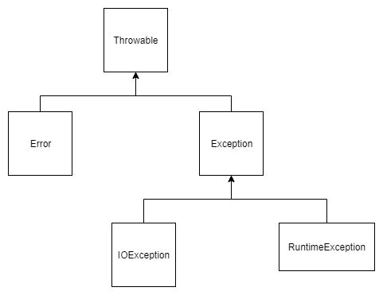
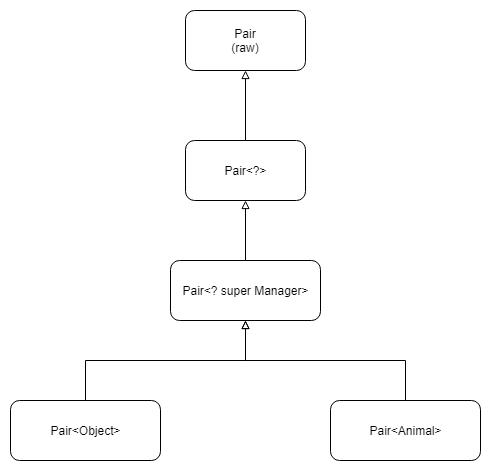

## Java核心技术（基础知识）笔记


### 第一章 Java程序设计概述

#### 面向对象设计

用木匠打个比方，一个“面向对象的”木匠始终关注的是所制作的椅子，第二位才是所使用的工具；一个“非面向对象”的木匠首先考虑的是所用的工具。


#### 即时编译

解释虚拟机指令肯定会比全速运行机器指令慢很多。然而，虚拟机有一个选项，可以将执行最频繁的字节码序列翻译成机器码，这一过程被称为即时编译。

字节码可以（在运行时刻）动态的翻译成对应运行这个应用的特定CPU机器码。

即时编译器还可以消除函数调用（即“内联”）。


### 第三章 Java的基本程序设计结构

####一个简单的Java应用程序

根据Java语言规范，Java虚拟机将从指定类中的main方法开始执行。

不过，当main方法不是public时，有些版本的Java解释器也可以执行Java应用。这是因为Java虚拟机规范并没有要求main方法一定是public。这个问题已经得到了修复，在Java SE 1.4及以后的版本中强制main方法时public的。


####整形

从Java 7开始，加上前缀0B或者0b就可以写二进制数。例如：0b1001就是9。同样，从Java 7开始，还可以为数字字面量加下划线，如用1_000_000表示一百万。


####浮点类型

所有”非数值“的值都认为是不同的。

```java
if (x == Double.NaN) // is never true
```

可以使用 Double.isNaN() 来判断（长得帅的肯定会戳进去看一下源码，很有意思哦）。

浮点数不适用于无法接受舍入误差的金融计算中。例如，

```java
double result = 2.0 - 1.9; // result = 0.10000000000000009
```

这是因为二进制无法精确的表示 1/10。

可移植性是Java的设计目标之一。无论在哪个虚拟机上运行，同一运算应该得到同样的结果。对于浮点数的算术运算，实现这样的可移植性是相当困难的。double类型使用64位储存一个数值，而有些处理器使用80位浮点寄存器。这些寄存器增加了中间过程的计算精度。例如：

```java
ddoble w = x * y / z;
```

使用严格浮点计算，截断中间数，可以了解一下 strictfp 关键字。


####char类型

转义字符\u可以出现在加引号的字符常量或字符串之外（其他的转义字符不行）。例如：

```java
public static void main(String\u005B\u005D args)
```

\u005B\u005D其实就是[]，所以上面的代码就是程序的入口main函数。

Unicode转义字符会在解析代码之前得到处理，举个吓死人的例子：

```java
// file in c:\user
```

当你在代码里面加上这行注释的时候，点击运行按钮就会发现，编译过不了！！！我的理解是先会将文件里面的转义字符全部处理一下，当处理到这行注释的时候，发现了 `\u` 会当成转义字符来处理，但是 `\u` 后面的字符不合法，所以就报错了。

Unicode的基本平面，辅助平面，码点的概念，可以看维基百科。

一个字符可能有多个码点，一个char只能表示一个码点。


####运算符

整数被0除将会产生一个异常，而浮点数被0除将会得到无穷大或者NaN结果。


####数值类型之间的转换

两个操作数有一个是 double ，则两个数按照 double 处理，

否则，有一个是 float，则两个数按照 float 处理，

否则，有一个是 long，则两个数按照 long 处理，

否则，两个数按照 int 处理。

```java
byte a = 1;
byte b = 2;
byte c = a + b; // error
```

```java
byte a = 1;
a += 1; // ok，因为 += 会自动进行强制转换
```


####位运算符

处理整形类型时，可以直接对组成整形数值的各个位完成操作，浮点数不行。

```
int a = 1;
a << 1; // ok
double b = 3;
b << 1; // error
```

位移运算符的右操作数要完成模32的运算（如果左操作是long型，则需要模64）。

```java
1 << 35 相当于 1 << 3
```


####字符串

编译器可以让字符串共享，只有字符串常量是共享的，+或者substring等操作产生的结果并不是共享的。


####格式化输出：

使用参数索引来对一个参数进行多次格式化：

```java
System.out.print("%1$s %2$tB %2$te %2$tY", "Due date:", new Date());
```

可以看到第二个索引对`new Date()`参数格式化了多次。使用`<`标志也可以达到同样的效果。

```java
System.out.print("%s %tB %<te %<tY", "Due date:", new Date());
```


####数组

Java中，允许数组长度为0，数组长度为0和null不同。


####数组排序

```java
Arrays.sort(a); // 这个方法使用了优化的快速排序算法
```

利用数组写一个抽彩游戏（这个算法还是很有想法的）：

```java
int[] numbers = new int[n];

for(int i=0; i<n; i++) {
    numbers[i] = i + 1;
}

int[] result = new int[k];
for (int i=0; i<k; i++) {
    int r = (int)(Math.random() * n);
    result[i] = numbers[r];
    // 最关键的代码，将上面随机出来的数用最后一个数覆盖
    numbers[r] = numbers[n - 1];
    // 将 n 减一，相当于去掉最后一个数
    n--;
}
```


### 第四章 类与对象

####面向对象程序设计概述

OOP将数据放在第一位，然后再考虑操作数据的算法。


####对象

对象状态的改变必须通过调用方法实现，如果不经过方法调用就可以改变对象状态，只能说明封装性遭到了破坏。


####类之间的关系

最常见的关系有：

- 依赖（“use-a”）
- 聚合（“has-a”）
- 继承（“is-a”）


####Java类库中的LocalDate类

将时间与日历分开是一种很好的面向对象设计。通常，最好使用不同的类表示不同的概念。


####用户自定义类

在一个源文件中，只能有一个公有类，但可以有任意数目的非共有类。

第一眼看到这句话我是懵逼的，后来仔细看了代码，发现应该说的是非内部类。

```java
// Main.java
public class Main{
    public class Inner{}
}

class Main2 {
    
}
```

上面的源文件是Ok的。但是把Main2改成public的就不行。


####封装的优点

可以改变内部实现，除了该类的方法之外，不会影响其他代码。

更改器方法可以执行错误检查，然而直接对域进行赋值将不会进行这些处理。


####静态常量

我们常使用的System类

```java
public class System {
    ...
    public static final PrintStream out = ...;
}
```

我们知道 final 修饰的变量是不允许将别的值赋给它的，但是System类有这样的一个方法：

```java
public static void setOut(PrintStream out) {...}
```

它可以将System.out设置为不同的流，原因是setOut是一个本地方法，它可以绕过Java语言的存取控制机制。


####方法参数

Java程序设计语言总是采用按值调用。有些程序员认为Java程序设计语言对对象采用的是引用调用，实际上，这种理解是不对的，下面给出例子：

```java
public static void swap(Car a, Car b) {
    Car temp = a;
    a = b;
    b = temp;
}
```

如果Java对对象采用的是按照引用传递，那么这个方法应该够实现交换数据的效果，但是，并没有。参数被初始化为对象引用的拷贝。


####初始化块

调用构造器的具体处理步骤：

1. 所有数据域被初始化为默认值（0，false或null）。
2. **按照在类声明中出现的顺序**，依次执行所有域初始化语句和初始化块。
3. 如果构造器第一行调用了第二个构造器，则执行第二个构造器主体。
4. 执行这个构造器的主题。

```java
public class Main {
    {
        a = 2;
    }
    private int a = 3;
    
    public int getA() {
        return a;
    }
}

// Main m = new Main(); 问，m.getA() 的值？
```


#### 对象析构与 finalize 方法

在实际应用中，不要依赖使用 finalize 方法回收任何短缺的资源，这是因为很难知道这个方法什么时候才能够调用。

我一直觉得，final，finally，finalize有啥区别，这个问题很傻×，因为他们毛关系没有，区别从何谈起。问问 final  与 volitile的区别吧！！！


####将类放入包中

假定有一个源文件开头有下列语句：

```java
package com.aprz;
```

编译器在编译源文件的时候不检查目录结构，即使这个源文件没有在子目录 com/aprz 下，也可以进行编译。但是，最终的程序将无法运行。如果包与目录不匹配，虚拟机就找不到类。


####包作用域

如果，把一个类文件放置在类路径的某处的 java/awt 子目录下，那么我们就可以访问 java.awt 包的内部了。非常危险！

从 1.2 版开始，JDK 的实现者修改了类加载器，明确禁止加载用户自定义的、包名以“java”开始的类！


####类路径

javac编译器总是在当前的目录中查找文件，但Java虚拟机仅在类路径中有“.”目录的时候才查看当前目录。如果没有设置类路径，那也并不会产生什么问题，默认的类路径包含“.”目录。然而如果设置了类路径却忘记了包含“.”目录，则程序仍然可以通过编译，但不能运行。

下面看一个类路径示例：

```
/home/user/classdir:.:/home/user/archives/archive.jar
```

假定虚拟机要搜寻 `com.horstmann.corejava.Employee`类文件。它首先要查看储存在jre/lib和jre/lib/ext目录下的归档文件中所存放的系统类文件。显然，在那里找不到相应的类文件，然后再查看类路径。然后查找一下文件：

```
/home/user/classdir/com/horstmann/corejava/Employee.class
com/horstmann/corejava/Employee.class从当前目录开始
com/horstmann/corejava/Employee.class inside /home/user/archives/archive.jar
```

编译器定位文件要比虚拟机复杂得多。如果引用了一个类，而没有指出这个类所在的包，那么编译器将首先查找包含这个类的包，并询查所有的import指令，确定其中是否包含了被引用的类。例如，假定源文件包含指令:

```java
import java.util.*;
import com.horstmann.corejava.*;
```

并且源代码引用了Employe类。**编译器将试图查找jva.lang.Employee (因为java lang包被默认入）、java.util.Employee、com.hostmann.corejava.Employee和当前包中的Employee。**对这个类路径的所有位置中所列出的每个类进行逐查看。 如果找到了一个以上的类，就会产生编译错误(因为类必须是唯一的， 而import语句的次序却无关紧要)。

编译器的任务不止这些，它还要查看源文件( Source files) 是否比类文件新。**如果是这样的话，那么源文件就会自动地重新编译**。

在前面已经知道，仅可以导入其他包中的公有类。一个源文件只能包含一个公有类，并且文件名必须与公有类匹配。因此，**编译器很容易定位公有类所在的源文件**。当然，也可以从当前包中**导入非公有类**。这些类有可能定义在与类名不同的源文件中。如果从当前包中导入一个类，**编译器就要搜索当前包中的所有源文件，以便确定哪个源文件定义了这个类**。

这一段很长，我只能说QQ的图片文字识别真的牛逼。


### 第五章 继承

#### 类、超类和子类

前缀“超”与“子”来源于计算机科学和数学理论中的集合语言的术语。

#### 覆盖方法

尽管子类对象有父类的私有域，但是却无法在子类中访问这个域。（这句话是我总结的，可能并不严谨）

有些人（包括我）认为super与this应用是类似的概念，实际上，这样比较并不太恰当。这是因为super不是一个对象的引用，不能将super赋给另一个对象变量，它只是一个只是编译器调用超类方法的特殊关键字。

#### 动态绑定

虚拟机知道一个引用的对象类型，所以能够正确的调用相应的方法。

#### 多态

在Java中，子类数组的引用可以转换成超类数组的引用，而不需要采用强制类型转换。例如：

```java
public class A {}
public class B extends A {}

B[] bs = new B[8];
A[] as = bs;
```

但是这样会有一个问题，如下：

```java
as[0] = new A();
```

编译器是会接纳这个赋值操作的。由于bs与as指向同一个数组，当调用B中特有的方法时，就会出现错误。而且在运行时还会报出 ArrayStoreException 错误。

#### 理解方法调用

1. 编译器查看对象的声明类型和方法名。假设调用 `x.f(param)`，且隐私参数`x`声明为`C`类的对象。编译器会一一列举所有`C`类中名为`f`的方法和其超类中访问属性为`public`且名为`f`的方法。
2. 接下来，编译器将查看调用方法时提供的参数类型。如果在所有名为f的方法中存在一个与提供的参数类型完全匹配，就选择这个方法。这个过程被称为*重载解析*。

<u>允许子类将覆盖方法的返回类型定义为原返回类型的子类型。</u>

```java
// A.java
public Father find() {...}
--------------------------------
// B.java
@Override
public Son find() {...}
```

3. 如果是 private方法，static方法，final方法或者构造器，那么编译器可以准确的知道应该调用哪个方法，这种调用方式就是*静态绑定*。
4. 当程序运行，并且采用动态绑定调用方法时，虚拟机一定调用与x所引用对象的实际类型最合适的那个类的方法。每次调用方法都要进行搜索，时间开销相当大。因此，虚拟机预先为每个类创建了一个方法表，其中列出了所有方法的签名和实际调用的方法。这样一来，在真正调用的时候，虚拟机仅查找这个表就行了。

<u>在覆盖一个方法的时候，子类不能低于超类方法的可见性。</u> 

#### 阻止继承：final类和方法

在早期的Java中，有些程序员为了避免动态绑定带来的系统开销而使用final关键字。如果一个方法没有被覆盖而且很短，编译器就能够对它进行优化处理，这个过程为称为*内联*。例如，内联调用 `e.getName()`将被替换为访问`e.name`域。这是一项很有意义的改进，这是由于CPU在处理调用方法的指令时，使用的分支转移会扰乱预取指令的策略。然面，如果`getName`在另外个类中被覆盖， 那么编译器就无法知道覆盖的代码将会做什么操作，因此也就不能对它进行内联处理了。

 幸运的是，虚拟机中的即时编译器比传统编译器的处理能力强得多。这种编译器可以准确地知道类之间的继承关系，并能够检测出类中是否真正地存在覆盖给定的方法。如果方法很简短、被频繁调用且没有真正被覆盖，那么即时编译器就会将这个方法进行内联处理。如果虚拟机加载了另外一个子类，而在这个子类中包含了对内联方法的覆盖，那么将会发生什么情况呢?优化器将取消对覆盖方法的内联。这个过程很慢，但却很少发生。

#### Object：所有类的超类

所有的数组类型，不管时对象数组还是基本类型的数组都扩展了Object类。

#### equals方法

在子类中定义 equals 方法时，首先调用超类的 equals。如果检测失败，对象就不可能相等。如果超类中的域都相等，就需要比较子类中的实例域。

#### 相等测试与继承

如果隐私和显式的参数不属于同一个类，equals方法将如何处理呢？这是一个很有争议的话题！

许多程序员喜欢使用 instanceof 进行检测：

```java
if(!(otherObject instanceof Person)) {
    return false;
}
```

这样做不但没有解决 otherObject 是子类的情况，并且还有可能会招来一些额外的麻烦。

Java语言规范要求 equals 方法具有下面的特性：

1. 自反性
2. 对称性
3. 传递性
4. 一致性
5. 对于任意非空引用x，x.equals(null)，应该返回false。

就对称性来说，当参数不属于同一个类的时候需要仔细思考一下。

```
e.quals(m);
```

e 是父类，m是子类。如果这两个对象的实例域都一样，当使用 instanceof 操作符的时候，会返回 true，那么意味着，m.equals(e)，也会返回true。但是实际上，反过来调用是无法通过 instanceof 操作符的。

建议的规则：

- 如果子类能够拥有自己的相等概念，则对称性需求将强制采用 getClass进行检测
- 如果由超类决定相等的概念，那么就可以使用 instanceof 进行检测，这样可以在不同子类的对象之间进行相等的比较。

一个完美equals方法的编写模板：

1. 显示参数命名为 otherObject，稍后需要将它转换成另一个叫做 other 的变量。

2. 检测 this 与 otherObject 是否引用同一个对象。

   ```java
   if (this == otherObject) {
       return true;
   }
   ```

3. 检测otheObject是否为null，如果为null，返回false。

   ```java
   if(otherObject == null) {
       return false;
   }
   ```

4. 比较this与otherObject是否属于同一个类。如果equals的语义在每个子类中有所改变，就使用getClass检测。如果所有的子类拥有统一的语义，就使用instanceof检测。

5. 将otherObject转换为相应类型的变量

   ClassName other = (ClassName) otherObject;

6. 开始对所有需要比较的域进行比较，如果在子类中重新定义equals，就要在其中包含调用 super.equals(other)。

一种常见的错误是将equals方法的参数类型改为具体需要比较的类型：

```java
public boolean equals(Person p) {...}
```

注意上面的方法不是覆盖，因为参数类型不一样，Object类中equal方法的参数是Object。

#### hashCode

```java
StringBuilder sb = new StringBuilder("ok");
StringBuffer tb = new StringBuffer("ok");
```

注意，sb与tb的hashCode不一样，这是因为StringBuffer没有定义自己的hashCode方法。

<u>equals方法相等则hashCode必须一致。</u>

#### 泛型数组列表

一旦确定数组列表的大小不再发生变化，就可以调用 trimToSize 方法。这个方法将储存区域的大小调整为当权元素数量所需要的储存空间数目。垃圾回收器将回收多余的储存空间。

#### 对象包装器与自动装箱

对象包装器类是不可变的，即一旦构造了包装器，就不允许更改包装在其中的值。同时，对象包装器类还是final，因此不能定义它们的子类。

自动装箱规范要求 boolean、byte、char <= 127，介于-128~127之间的short和int被包装到固定的对象中。这句话乍一看很诡异，其实都是同一个意思。

char 的范围是从 0 ~ 65535。

#### 在运行时使用反射分析对象

setAccessible方法时AccessibleObject类中的一个方法，它是Field、Method和Constructor类的公共超类。

利用get方法可以访问域的值，但是有一个需要解决的问题。如果域是一个String类型，把它当作Object返回没有什么问题，但是，假设这个域是double类型的，而Java中数值类型不是对象，该怎么办呢？其实反射机制会自动地将这个域值打包到相应的对象包装器中。invoke 方法也是如此。

#### 继承的设计技巧

1. 将公共操作和域放在超类

2. 不要使用受保护的域

   protect 在某种程度上破坏了封装，因为同一个包类的代码也可以访问该域。

   子类也可以随便访问超类的protect域。

3. 使用继承实现“is-a”关系

4. 除非所有继承的方法都有意义，否则不要使用继承

5. 在覆盖方法时，不要改变预期的行为

6. 使用多态，而非类型信息

7. 不要过多的使用反射


### 第六章 接口、lambda表达式与内部类

#### Comparable\<T> 接口

- 如果子类之间的比较含义不一样，那就属于不同类对象的非法比较。每个compareTo方法都应该在开始时进行下列检测：

  ```java
  if (getClass() != other.getClass) {
      throw new ClassCastException();
  }
  ```

- 如果存在一种通用算法，它能够对两个不同的子类对象进行比较，则应该在超类中提供一个compareTo方法，并将这个方法声明为final。

#### 静态方法

在Java SE8中，允许在接口中增加静态方法。只是有违于将接口作为抽象规范的初衷。

目前为止，通常的做饭都是将静态方法放在伴随类中。Collection/Collections......

#### 默认方法

可以为接口提供一个默认方法。必须用default修饰符标记这样的一个方法。

一般来说，这并没有太大的用处。但是当一个接口的方法特别多是就可以很有用。

```java
public interface Listener {
    void fa();
    void fb();
    void fc();
    void fd();
    void fe();
}
```

大多数情况下，我们只关心其中的一两个方法。在Java SE8 中我们就可以将它声明为默认方法，什么也不做。

```java
public interface Listener {
    default void fa() {};
    default void fb() {};
    default void fc() {};
    default void fd() {};
    default void fe() {};
}
```

这样一来，使用者就只需要覆盖真正关心的方法。

默认方法的一个重要作用是“接口演化”。以Collection接口为例，假设你有一个类实现了这个接口：

```java
public class Bag implements Collection {...}
```

后来，在Java SE8中，又为这个接口增加了一个stream方法。

假设steam不是默认方法。那么Bag类将无法编译，因为它没有实现这个方法。**为接口增加一个非默认方法不能保证源代码兼容。**

不过，如果不重新编译这个类，而是使用原来的包含这个类的JAR文件，这个类仍然可以正常加载。**为接口增加方法可以保证二进制兼容。**不过，如果调用了steam方法，就会抛出一个AbstractMethodError。

#### 解决默认方法冲突

如果先在一个接口中将一个方法定义为默认方法，然后又在超类或另一个接口中定义了同样的方法，会发生什么情况呢？

1. 超类优先。如果超类提供了具体的方法，会忽略接口的默认方法。可以保证与Java SE7的兼容性。
2. 接口冲突。如果一个接口提供了默认方法，另一个接口提供了一个同名且参数类型相同的方法（不管是不是默认的），必须覆盖这个方法来解决冲突。

**千万不要让一个默认方法重新定义Object类中方法**！！！

#### 对象克隆

clone方法是Object的一个protected方法，这说明你的代码不能直接调用这个方法。

默认的克隆操作是“浅拷贝”，并没有克隆对象中引用的其他对象。

Cloneable接口并没有什么作用，它只是一个标记，指示类设计者了解克隆过程，clone方法是从Object类中继承过来的。

必须当心子类的克隆。

#### 为什么引入lambda表达式

lambda表达式是一个可传递的代码块，可以在以后执行一次或多次。

#### lambda表达式的语法

如果可以推导出一个lambda表达式的参数类型，则可以忽略其类型。例如：

```java
Comparator<String> comp = 
    (first, second) -> first.length() - second.length();
```

无需指定lambda表达式的返回类型。lambda表达式的返回类型总是会由上下文推导得出。

如果，一个lambda表达式只在某些分支返回一个值，而在另外一些分支不返回值，这是不合法的。

```java
(int x) -> { if(x >= 0) return 1;}
```

#### 函数式表达式

对于只有一个抽象方法的接口，需要这种接口的对象时，就可以提供一个lambda表达式。这种接口成为函数式接口。

最好把lambda表达式看作是一个函数，而不是一个对象，另外要接受lambda表达式可以传递到函数式接口。

不过，Java现在对lambda表达式能做的也只是转换为函数式接口。

Java API 在 java.util.function 包中定义了很多通用的函数式接口。例如：BiFunction<T,U,R>。

#### 方法引用

有时，可能已经有现成的方法可以完成你想要传递到其他代码的某个动作。例如：

```java
Timer t = new Timer(1000, event -> System.out.println(event));
```

这样，看起来很简洁了，但是如果能把 println 方法传递到 Timer 的构造器就更好了，如下：

```java
Timer t = new Timer(1000, System.out::println);
```

表达式 System.out::println 是一个方法引用，它等价于 x-> System.out.println(x);

方法引用的写法有3中：

- objcet::instanceMethod
- Class::staticMethod
- Class::instanceMethod

前两种情况，方法引用等价于提供方法参数的lambda表达式。

对于第三种情况，第一个参数会成为方法的目标。例如：

```java
String::compareToIgnoreCase 等价于
(x, y) -> x.compareToIgnoreCase(y);
```

可以在方法引用种使用 this 与 super。

#### 构造器引用

构造器引用与方法引用类似，只不过方法名为new。例如，Person::new是Person构造器的一个引用。但是它具体引用的是哪个构造器与上下文有关。

```java
ArrayList<String> names = ..;
Stream<Person> stream = names.steam().map(Person::new);
```

map方法会调用Person(String) 构造器。

可以用数组类型建立构造器引用。例如，int[]::new 是一个构造器引用，**它有一个参数：即数组的长度**。

Java有一个限制，无法构造泛型类型T的数组。new T[] 会产生错误。

#### 变量作用域

有时候，我们会在lambda表达式种访问外围方法或类中的变量。例如：

```java
String text = "ok";
ActionListener listener = event -> {
  	Sysout.out.println(text);  
};

// 1000年之后
new Timer(delay, listener);
```

仔细想想，这里会有问题。lambda表达式的代码可能会在很久之后才运行，那个时候，text可能已经不存在了。要了解发生了什么，我们先来了解lambda表达式的组成：

1. 一个代码块
2. 参数
3. 自由变量的值，这是指非参数而且不在代码中定义的变量。

<u>lambda表达式的数据结构必须存储自由变量的值。</u> 关于代码块与自由变量在别的语言里面有一个术语叫闭包。

lambda表达式引用了自由变量，无法对这个自由变量进行更改，因为会引发多线程问题。

在一个lambda表达式中使用this关键字时，是指创建这个lambda表达式的方法的this参数。

```java
public class Application {
    public void init {
        ActionListener listener = event -> {
            Sysout.out.println(this.toString());
        }
    }
}
```

表达式会调用Application的toString，而不是 ActionListener的toString。

#### 处理lambda表达式

如果设计你自己的接口，其中只有一个抽象方法，可以用 @FunctionalInterface 注解来标记这个接口。

#### 再谈Comparator

静态 comparing 方法取一个“键提取器”函数，它将类型T映射为一个可比较的类型。对要比较的对象应用这个函数，然后对返回的键完成比较。

```java
Arrays.sort(people, Comparator.comparing(Person::name));
```

还有很多其他的方法，需要自己去戳源码。

#### 内部类的特殊规则语法

可以通过显示的命名将外围类引用设置为其他的对象。

```java
public class Out{
    public class In {
        
    }
}
-----------------------------
Out o = new Out();
Out.In in = o.new In();
```

非静态内部类的所有静态域都必须是final的。

非静态内部类不能有static方法。

非static的内部类，在外部类加载的时候，并不会加载它，所以它里面不能有静态变量或者静态方法。

- static类型的属性和方法，在类加载的时候就会存在于内存中。
- 要使用某个类的static属性或者方法，那么这个类必须要加载到jvm中。 

基于以上两点，可以看出，如果一个非static的内部类如果具有static的属性或者方法，那么就会出现一种情况：内部类未加载，但是却试图在内存中创建static的属性和方法，这当然是错误的。原因：类还不存在，但却希望操作它的属性和方法。

#### 内部类是否有用、必要和安全

内部类是一种编译器现象，与虚拟机无关。编译器将会把内部类翻译成用 $ 符号分隔外部类名与内部类名的常规类文件，而虚拟机对此一无所知。

内部类是如何访问外部的？

```java
class Out {
    
    private int a;
    
    class In {

    }
    
    // 这是编译器自动生成的方法，我们在内部类中调用a，实际上是使用了这个方法
    static int access$0(Out);
    
}
```

#### 匿名内部类

由于构造器的名字必须与类名相同，而匿名类没有类名，所以，匿名类不能有构造器。取而代之的是将构造参数传递给超类构造器。

对于静态方法的日志问题，如果我们希望在静态方法中输出当前类的类名，但是静态方法没有this，可以使用如下方法：

```java
new Object(){}.getClass().getEnclosingClass();
```

#### 代理的特性

所有的代理类都覆盖了Object类中的方法 toString、equals和hashCode。

对于特定的类加载器和预设的一组接口来说，只能有一个代理类。如果使用同一个类加载器和接口数组调用两次 newProxyInstance 方法的话，那么只能得到同一个类的两个对象。

如果代理类实现的所有接口都是public的，那么代理类不属于某个特定的包。否则。所有非公有的接口都必须属于同一个包，代理类也属于这个包。


### 第七章 异常、断言和日志

#### 异常分类




Error类层次结构描述了Java运行时系统的内部错误和资源耗尽错误。

Exception分为两个分支：

> 一个分支派生于RuntimeException，另一个包含其他异常。
>

**划分规则是**：由程序错误导致的异常属于RuntimeException；而程序本身没有问题，但由于像IO错误这类问题的异常属于其他异常。

#### 声明受查异常

如果在子类中覆盖了超类的一个方法，子类方法中声明的受查异常不能比超类方法中声明的异常更通用。

如果超类方法没有抛出任何受查异常，子类也不能抛出任何异常。

#### 捕获异常

通常，应该捕获那些知道如何处理的异常，而将那些不知道怎样处理的异常继续传递。

#### 捕获多个异常

在Java SE 7中，同一个catch子句中可以捕获多个异常类型。

> 只有当捕获的异常类型彼此之间不存在子类关系时才需要这个特性。
>
> 捕获多个异常类型时，异常变量隐含为final。

#### 再次抛出异常与异常链

在catch子句中可以抛出一个异常，这样做的目的是改变异常的类型。

```java
try {
    ...
} catch (AException a) {
    throw new BException("msg");
}
```

不过，有一种更好的处理方法，并且将原始异常设置为新异常的“原因”：

```java
try {
    ...
} catch (AException a) {
    Throwable t = new BException("msg"); 
    t.initCause(a);
    throw t;
}
```

这样我们调用 e.getCause() 就可以拿到原始异常。强烈推荐使用这种包装技术。这样可以让用户抛出子系统中的高级异常，而不会丢失原始异常的细节。

在Java SE 7之前，无法抛出声明异常之外的类型（虽然现在也是，但是编译器的行为不一样了）：

```java
public void update() throws SQLException {
    try {
        ...
    } catch(Exception e) {
        throw e;
    }
}
```

在Java SE 7之前，会有一个问题，编译器会指出这个方法可以抛出任何异常，而不仅仅是SQLException。

> 现在编译器会跟踪到 e 来自 try 块。假设这个try中仅有的已检查异常是 SQLException的实例，另外，e没有被改变，那么这个方法就是合法的。

#### finally子句

强烈建议解耦 try/catch 和 try/finally 语句块。这样可以提高代码的清晰度。

```java
InputStream in = ...;
try {
    try {
        ...
    } finally {
        ...
    }
} catch (Exception e) {
    ...
}
```

这种设计方式不仅清楚，而且还有一个功能，可以捕获 finally 里面的异常。

当 finally 子句包含return语句时：

```java
try {
    int r = n * n;
    return r;
} finally {
    if (n == 2) {
        return 0;
    }
}
```

在方法返回之前，finally 子句的内容将会执行。如果finally子句中也有一个return语句，这返回值将会覆盖原始的返回值。

finally 子句的异常可能会覆盖try中的异常：

```java
InputStream in = ...;
try {
    ...
} finally {
    in.close();
}
```

假设try块中抛出了非IOException，而close方法也出了异常，那么最后抛出的是 close 方法的 IOException。一般我们对 try 块中的异常更感兴趣，但是这时异常已经被丢失了，除非给  close 也加上 try 语句，这样就会非常繁琐。

#### 带资源的 try 语句

如果资源属于一个实现了 AutoCloseable 接口的类，Java SE 7 为这种代码模式提供了一个很有用的快捷方式。

```java
try (Resource res = ...) {
    ...
}
```

try 块退出时，或者存在一个异常，都会自动调用 `res.close();`，资源会被关闭。

这种 try 语句自身也可以带 catch 和 finally 语句，但是一般不用。


### 第八章 泛型程序设计

#### 定义简单泛型类

泛型类可以看作普通类的工厂。

#### 类型变量的限定

一个类型变量或通配符可以有多个限定：

```java
T extends Comparable & Serializable
```

限定类型用 & 分隔，而逗号用来分隔类型变量。如果用一个类来做限定，它必须是限定列表中的第一个。

#### 类型擦除

虚拟机没有泛型对象，它会擦除类型变量，并替换为限定类型（无限定类型的变量用Object）。

如果有多个限定，会怎么样呢？

```java
class Interval<T extends Serializable & Compareable>
```

原始类型用 Serialzable 替换 T，编译器会在必要的时候将其强制转换为 Comparable。为了提高效率，应该将标签接口（没有方法的接口）放在边界列表的末尾。

<u>当程序调用泛型方法时，如果擦除返回类型，编译器插入强制类型转换。</u>

#### 翻译泛型方法

假设我们有这样的一个类：

```java
class Pair<T> {
    private T first;
    private T second;
    
    ...
        
	public void setSecond(T second) {
        this.second = second;
    }
    
}
-----------------------------------
// 擦除之后，这里 T 擦除之后是 Object
class Pair {
    private Object first;
    private Object second;
    
    ...
        
	public void setSecond(Object second) {
        this.second = second;
    }
    
}
```

使用一个类继承它：

```java
class Date extend Pair {
    
}
-----------------------------------------------
class Date extend Pair<LocalDate> {
    // 这里不是重写，只是展示有一个从父类继承过来的方法
	public void setSecond(LocalDate second) {
        ...
    }
}
```

于是问题就来了，假设我使用父类引用子类的变量，然后调用 setSecond 方法，那么它本来应该走到子类的方法里面去，但是由于泛型的擦除，导致子类方法签名不一致了（父类是 Object，子类是 LocalDate）。

```java
Date date = new Date();
Pare<LocalDate> pair = date;
// 猜猜它会调用那个方法
pair.setSecond(aDate);
```

现在多态与泛型擦除出现了冲突，解决方法是需要编译器在 Date类中生成一个桥方法。

```java
public void setSecond(Object second) {
    setSecond((Date)second);
}
```

然而，桥方法也会引出别的问题！

假设 Date 类覆盖了 getSecond 方法：

```java
class Date extend Pair {
    // 这里是重写
    @Override
    public LocalDate getSecond() {
        ...
    }
}
```

那么，Date 类里面就有两个同名方法了，参数一样，只有返回值不一样。编译器是不允许这样的，但是，在Java虚拟机中，用参数类型和返回类型确定一个方法。因此，编译器可能产生两个仅返回类型不同的方法字节码，虚拟机可以正确处理这样的情况。

如果你记忆力比较好的话，前面也提到过在覆盖父类的方法时，可以返回更加严格的类型，这也是利用的桥方法。

Java泛型转换的事实：

- 虚拟机中没有泛型，只有普通的类和方法
- 所有的类型参数都用它们的限定类型替换
- 桥方法被合成类保持多态
- 为保持类型安全性，必要时插入强制类型转换

#### 不能用基本类型实例化类型参数

其原因是类型擦除，擦除之后，没有限定类型的使用 Object 代替，而 Object 不能引用基本类型。

#### 运行时类型查询只适用于原始类型

```java
if (a instanceof Pair<String>)
```

这里只是测试了 a 是否时一个 Pair 对象，与 String 毫无关系。

同样的道理，getClass 也总是返回原始类型。

#### Varargs 警告

Java 不允许创建泛型数组，其原因可以自己研究研究（泛型擦除）。假设我们有这样方法：

```java
public static <T> void addAll(Collection coll, T... ts) {}
```

ts 实际上时一个数组，考虑一下调用：

```java
Collection<Pair<String>> table = ...;
Pair<String> p1 = ...;
Pair<String> p2 = ...;
addAll(table, p1, p2);
```

所以，Java虚拟机必须建立一个Pair\<String> 数组，这就违反了不循序创建泛型数组的规定。不过对于这种情况，只是会显示一个警告。

#### 不能构造泛型数组

最好让用户提供一个数组构造器的表达式。

#### 泛型类的静态上下文中类型变量无效

不能在静态域中引用类型变量。

```java
public class Singleton<T> {
    private static T singleInstance; // ERROR
}
```

因为如果能使用的话，不同的实例会有不同的类型。

#### 不能抛出或捕获泛型类的实例

泛型类扩展 Throwable 都是不合法的。

```java
class P<T> extends Exception {} // ERROR
```

在异常规范中使用类型变量是合法的。

```java
public static <T extends Throwable> void fun(T t) throws T {} // OK 
```

#### 可以消除对受查异常的检查

```java
@SuppressWarnings("unchecked")
public static <T extends Throwable> void throwAs(Throwable t) throws T {
    throw (T)t;
}
```

**编译器会认为t是一个非受查异常。**

再利用下面的代码就会把所有异常转换为编译器所认为的非受查异常：

```java
try {
    do work
} catch (Throwable t) {
    throwAs(t);
}
```

这样，在某些不允许抛出任何受查异常的方法中，就可以使用这个方法来抛出受查异常。

#### 注意擦除后的冲突

```java
public class Pair<T> {
    public boolean equals(T t);
}
```

擦除之后，就是 `public boolean equals(Object t);` 与 Object 的方法重复了，会引发错误。

#### 通配符概念

```java
void set(? extends Person) {...}
```

这个 set 方法不能传递任何参数，因为编译器只知道需要某个 Person 的子类，但是不知道具体是什么类型。

```:arrow_double_down:
void set(? super Person) {...}
```

该方法只能传递Person或者Person的子对象。

直观的讲，带有超类型限定的通配符可以向泛型写入，带有子类型限定的通配符可以从泛型对象读取。

举一个 super 限定符的应用：

> LocalDate 实现了 ChronoLocalDate，而 ChronoLocalDate 扩展了 Comparable\<ChronoLocalDate>。

> 因此，LocalDate 实现的是 Comparable\<ChronoLocalDate>，而不是 Comparable\<LocalDate>。

在这种情况下，可以使用超类限定符来救助（要注意泛型的 extends 与类的 extends 的不同意义）：

```:arrow_double_down:
public static <T extends Comparable<? super T>> T min(T[] a) {...}
```

上个图来意思意思：



#### 无限定通配符

```:arrow_double_down:
? getFirst()

void setFirst(?)
```

getFirst 的返回值只能赋值给 Object。setFirst不能被调用，Object 也不行。

#### 通配符捕获

```:arrow_double_down:
public static void swap(Pair<?> p)

public staic <T> void swapHelper(Pair<T> p)
```

比较有趣的是，可以在 swap 里面调用 swapHelper。这种情况下，参数 T 捕获通配符。

<u>通配符捕获只有在有许多限制的情况下才是合法的，编译器必须能够确信通配符表达的是单个、确定的类型。</u>

### 第九章 集合

#### 迭代器

对 next 方法和 remove 方法的调用具有互相依赖性。

#### 集合框架中的接口

List接口定义了多个用于随机访问的方法：

```java
void add(int index, E element);
void remove(int index);
E get(int index);
E set(int index, E element);
```

坦率的讲，集合框架的这个方面设计的很不好。

> 集合框架中有两种类型的集合，其性能开销有很大差异。由数组支持的有序集合可以快速地随机访问，因此适合使用List方法并提供一个整数索引来访问。而链表尽管也是有序的，但是随机访问会很慢，所以最好使用迭代器来遍历。所以如果原先就提供了两个接口就会容易理解些了。

为了避免对链表完成随机访问操作，Java SE 1.4 引入了一个<u>标记</u>接口 RandomAccess。用来测试一个特定的集合是否支持高效的随机访问：

```java
if (c instanceof RandomAccess) {
    // 支持
} else {
    // 不支持
}
```

Set接口等同于Collection接口，不过其方法的行为有更严谨的定义。

- add 方法不允许增加重复的元素
- equals 方法：只要两个集合包含相同的元素就认为是相等的，而不要求这些元素有相同的顺序
- hashCode 方法：要保证含相同元素的两个集会得到相同的散列码

既然两个接口的方法签名是一样的，为什么还要建立一个单独的接口呢？

> 从概念上讲，并不是所有集合都是集。建立一个Set接口可以让程序员编写只接收集的方法。

#### 链表

在 Java 程序设计语言中，所有链表实际上都是双向链接的。

ListIterator 是 Iterator 的一个子接口，它新增了一些方法。LinkedList 的 listIterator 方法会返回一个 ListIterator 的实例。注意，在使用 ListIterator 的 remove 方法时需要谨慎。

在调用 next 之后，remove 方法会删除迭代器左侧的元素，但是，如果调用 previous 会删除迭代器右侧的元素。

ConcurrentModificationException 异常的检测有一个特例：

链表只负责跟踪对列表的结构性修改，例如，添加元素，删除元素。set方法<u>不被视为</u>结构性修改。**可以将多个迭代器附加给一个链表，所有的迭代器都调用set方法对现有的结点的内容进行修改。**

**不要使用**下面的方法来遍历链表：

```java
for (int i=0; i<list.size(); i++) {
    Element e = get(i);
}
```

虽然 get 方法做了微小的优化（如果 i 大于 size()/2，会从后面开始遍历），但是这样写每次循环都要遍历一次。

#### 散列表

在 Java中，散列表用链表数组实现。

#### 树集

Java SE 8 中使用的是红黑树。

将一个元素添加到树中要比添加到散列表中慢，不过与检查数组或链表中重复元素相比还是快很多。

#### 优先级队列

优先级队列并没有对所有的元素进行排序。它使用了一个优雅且高效的数据结构——堆。

#### 映射 （Map） 

总感觉翻译有点奇怪！！！

#### 更新映射项

看一个例子，统计单词出现的频率：

```java
counts.put(word, counts.get(word) + 1);
```

这会有一个问题，就是 get 可能会返回 null。于是可以这样写，给一个默认值：

```java
counts.put(word, counts.getOrDefault(word, 0) + 1);
```

另一种方法就是先调用 putIfAbsent：

```java
counts.putIfAbsent(word, 0);
counts.put(word, counts.get(word) + 1);
```

不过，还可以有更简单的方式，使用 merge 方法，可以简化这个常见的操作：

```java
counts.merge(word, 1, Integer::sum);
```

如果键值不存在，则将 word 置为 1，否则使用 Integer::sum 函数组合原值和 1。

#### 映射视图

集合框架不认为Map本身是一个集合。

Map提供了方法用来获取映射视图，映射视图是实现了Collection接口或某个子接口的对象。

```java
Set<K> keySet();
Collection<V> values();
Set<Map.Entry<K,V>> entrySet();
```

这3个方法会分别返回3个视图。要注意这些视图并不是 TreeSet 或者 HashSet 的实例，而是实现了 Set 接口的另外某个类的实例。

#### 视图与包装器

再来说说 keySet 方法。初看起来，好像这个方法创建了一个新集，并将映射中的所有键都填进去，然后返回这个集。但是，情况并非如此。取而代之的是：keySet 方法返回一个实现 Set 接口的类对象，这个类的方法对原映射进行操作。这种集合称为视图。

#### 轻量级集合包装器

```java
List<Card> cardList = Arrays.asList(cardDeck);
```

asList 返回的并不是一个 ArrayList。它是一个视图对象，带有访问底层数组的 get 和 set 方法。改变数组大小的所有方法都会抛出一个 UnsupportedOperationException 异常。

#### 子范围

```java
List group2 = staff.subList(10, 20);
group2.clear();
```

元素自动的从 staff 列表中清除，并且 group2 为空。

#### 不可修改的视图

简而言之，就是对所有更改器方法直接抛出一个异常。

<u>由于视图只是包装了接口而不是实际的集合对象，所以只能访问接口中定义的方法。</u>

注意，视图并没有重新定义 Object 的 equals 和 hashCode 方法（内容是否相等的检测在分层结构的这一层上没有定义妥当）。

#### 受查视图

“受查”视图用来对泛型类型发生问题时提供调试支持。

```java
ArrayList<String> strings = new ArrayList<>();
ArrayList rawList = strings;
rawList.add(new Date());
```

这个错误在 add 的时候检测不到。相反，只有在调用 get 方法的时候才会抛出异常。受查视图可以探测这类问题。

```java
List<String> safeStrings = Collections.checkList(strings, String.class);
ArrayList rawList = safeStrings;
rawList.add(new Date()); // Error
```

虚拟机在运行到 add 方法时，就会抛出异常。

#### 排序与混排

可以使用归并排序对链表进行高效的排序。但是Java中不是这样做的。它直接将所有元素转入一个数组，对数组进行排序，然后，再将排序后的序列复制会链表。

集合类库中使用的排序算法比快速排序要慢一些，快速排序时通用排序算法的传统选择。但是，归并排序有一个主要的优点：稳定，即不需要交换相同的元素。

#### 二分查找

只有采用随机访问，二分查找才有意义。

### 第十四章 并发

#### 中断线程

没有可以强制线程终止的方法。然而，interrupt 方法可以用来请求线程终止。

但是，如果线程被阻塞，就无法检测中断状态。

当在一个被阻塞的线程（sleep或者wait）上调用 interrupt 方法时，阻塞调用将会被 Interrupted Exception 异常中断。

如果在每次工作迭代之后都调用 sleep 方法（或者其他可中断方法），isInterrupted 检测既没有必要也没有用处。如果在中断状态被置位时调用 sleep 方法，它不会休眠。相反，它将清除这一状态并抛出InterruptedException。

不要将 InterruptedException 捕获在低层次上！

> 要么捕获然后再次设置中断状态，要么直接抛出。

#### 可运行线程

在任何给定时刻，一个可运行的线程可能在运行也可能没有运行（这就是为什么将这个状态称为可运行而不是运行）。

#### 被阻塞线程和等待线程

被阻塞状态与等待状态是有很大不同的。其实这句话我还不太能够理解，是本质上不同，还是Java行为上不同？

#### 线程优先级

每一个线程有一个优先级。默认情况下，一个线程继承它的父线程的优先级。

#### 守护线程

守护线程应该永远不去访问固有资源，如文件，数据库，<u>因为它会在任何时候甚至在一个操作的中间发生中断。</u>

setDaemon 必须在线程启动之前调用。

#### 未捕获异常处理器

线程的 run 方法不会抛出任何受查异常，非受查异常会导致线程终止。在线程死亡之前，异常被传递到一个用于未捕获异常的处理器。

> setUncaughtExceptionHandler 方法会未任何线程安装一个默认的处理器。
>
> 也可以用Thread类的静态方法 setDefaultUncaughtExceptionHandler 为所有的线程安装一个默认的处理器。

如果不安装默认的处理器，默认的处理器为空。但是，如果不为独立的线程安装处理器，此时的处理器就是该线程的 ThreadGroup 对象。

ThreadGroup 类实现 Thread.UncaughtExceptionHanlder 接口。它的 uncaughtException 方法做如下操作：

1. 如果该线程组有父线程组，那么父线程组的 uncaughtException 方法被调用。
2. 否则，如果 Thread.getDefaultExceptionHandler 方法返回一个非空的处理器，则调用该处理器。
3. 否则，如果 Throwable 是 ThreadDeath 的一个实例，什么都不做。
4. 否则，线程的名字以及 Throwable 的栈轨迹被输出到 System.err 上。

#### 锁对象 （ReentrantLock）

如果使用锁，就不能使用带资源的 try 语句。

> 一是无法释放锁，二是会新创建一个变量。

 锁是可重入的，因为线程可以重复地获得已经持有的锁。锁保持一个持有计数来跟踪对lock方法的嵌套调用。

#### 条件对象

使用一个条件对象来管理那些已经获得了一个锁但是却不能做有用工作的线程。

一个锁对象可以有一个或多个相关的条件对象。你可以用 newCondition 方法获得一个条件对象。

signalAll 方法不会立即激活一个等待线程。它仅仅解除等待线程的阻塞，以便这些线程可以在当前线程退出同步方法之后，通过竞争实现对对象的访问。

每一个对象有一个内部锁，并且该锁有一个内部条件。初学者常常对条件感到困惑，推荐先学习ReentrantLock 的 Condition。

wait、nofity、notifyAll 方法都需要当前线程持有锁，否则会抛出异常。

#### 同步阻塞

举一个有趣的例子：

```java
public class Sync {
    
    private Map<String, Person> pList = Collections.synchronizedList(new HashMap<>());
    
    public synchronized void putIfAbsent(String key, Person p) {
        if(!pList.contains(p)) {
            pList.put(p);
        }
    }
    
    public Person get(String key) {
        pList.get(key);
    }
    
}
```

先不管这个程序有什么意义，只问一个问题，这个类是线程安全的吗？

虽然看起来很像是线程安全的，但是实际上不是，因为 Collections.synchronizedList 使用的锁，肯定不是 Sync 的实例。

#### Volatile 域

仅仅为了读写一个或两个实例域就使用同步，显得开销过大了。Volatile 可以帮助我们在这种情况下避免使用锁。

先来看看多个线程为什么会出现值不一致的原因：

- 多处理器的计算机能够暂时在寄存器或本地内存缓存区中保存内存的值。结果是，运行在不同处理器上的线程可能在同一个内存位置取到不同的值。
- 编译器可以改变指令执行的顺序以使吞吐量最大化。这种顺序上的变化不会改变代码语义，但是编译器假定内存的值仅仅在代码中有显示的修改指令时才会改变。然而，内存的值可以被另一个线程改变！

早期的CPU使用的是总线锁的方式来保证 Volatile 域的一致性，现在都使用的是缓存一致性。

#### final 变量

如果在某个类中，将一个域声明为 final 类型，那么会起到这样的一个效果：

> 其他的线程会在该类的构造函数执行完毕之后才能看到这个 final 域的值。

#### 原子性

假设对共享变量除了赋值之外并不完成其他操作，那么可以将这些共享变量声明为 volatile。

java.util.concurrent.atomic 包中有很多类使用了<u>很高级的机器级指令（不是使用锁）</u>来保证其他操作的原子性。

稍微提一下，使用 compareAndSet 实现乐观锁的常用写法：

```java
do {
    oldValue = largest.get();
    newValue = Math.max(oldValue, observed);
} while (!largest.compareAndSet(oldValue, newValue));
```

compareAndSet 的工作原理：期望内存中的值是 oldValue，是则用 newValue 替换它，返回 true，不是则返回 false。

如果有大量线程要访问相同的原子值，函数性能会大幅下降，因为乐观更新需要太多次重试。

#### 锁测试与超时

<u>lock 方法不能被中断，在获得锁之前会一直阻塞</u>，如果出现死锁，则 lock 方法无法终止。可以使用 tryLock 来响应中断。

tryLock 还有一个隐藏特性：这个方法会抢夺可用的锁，即使该锁有公平加锁策略，即便其他线程已经等待很久也是如此。

#### 为什么弃用 stop 和 suspend 方法

stop 方法：该方法终止所有未结束的方法，包括 run 方法。当线程被终止，立即释放被它锁住的所有对象的锁。这会导致对象处于不一致的状态。

例如：从 A 转账到 B，线程突然被终止，钱已经转出去了，却没有进入 B 账户，那么 Bank 对象就被破坏了。

suspend 方法：如果用该方法挂起一个持有锁的线程，那么该锁在恢复之前是不可用的。如果调用 suspend 方法的线程试图获得同一个锁，那么程序死锁：被挂起的线程等着被恢复，而将其挂起的线程等待获得锁。

#### ConcurrentHashMap 

```java
// map 是 ConcurrentHashMap 的实例
Long oldValue = map.get(word);
Long newValue = oldValue == null ? 1 : oldValue + 1;
map.put(word, newValue);
```

在上面的例子中，由于操作不是原子的，所以最终的结果不可预料。但是，要理解 ConcurrentHashMap 与 HashMap 的区别，这里的 get 与 put 都是原子操作，在多线程情况下不会破坏 map 的结构，而 HashMap 在多线程情况下会出现循环链表等问题。

ConcurrentHashMap 返回的迭代器具有弱一致性。这意味着迭代器不一定能反映出它们被构造之后的所有的修改（可以认为是某一特定时刻的快照），它们不会将同一个值返回两次，不会抛出 ConcurrentModificationException。

#### CopyOnWriteArrayList 和 CopyOnWriteArraySet

CopyOnWriteArrayList 和 CopyOnWriteArraySet 是线程安全的集合，其中所有的修改线程对底层数组进行复制。

#### 线程池

调用 shutdown 方法，该线程池不再接收新任务。当所有任务完成后，线程池死亡。

调用 shutdownNow 方法，该线程池取消尚未开始的所有任务，并视图中断正在运行的线程。

#### ExecutorCompletionService

如果有大量的 Callable 要执行，可以使用这个类。

#### Fork-Join 框架

这个框架用来分解子任务，提高线程利用率。

```java
class Counter extends RecursiveTasks<Integer> {
    protected Integer compute() {
        if (to - from < THRESHOLD) {
            // .....
        } else {
            int mid = (from + to) / 2;
            Counter first = new Counter(values, from, mid, filter);
            Counter second = new Counter(values, mid, to, filter);
            // 阻塞
            invokeAll(first, second);
            // 合并
            return first.join() + second.join();
        }
    }
}
```

#### 信号量

任何线程可以释放任何数量的许可，这可能会增加许可数目以至于超出初始数目。


