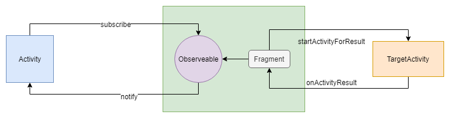

# OnResultHelper

OnResultHelper 这个类是用来简化 startActivityForResult() 方法的使用。


### 原来的使用方式

- 定义 requestCode

  ```java
  private static final int KEY_FOR_TAKE_PHOTO_HEALTH = 0x03;
  ```

- 调用 startActivityForResult 方法

  ```java
  startActivityForResult(intent);
  ```

- 重写 Activity 或者 Fragment 的方法

  ```java
  	@Override
      public void onActivityResult(int requestCode, int resultCode, Intent data) {
          if (RESULT_OK != resultCode || data == null) {
              return;
          }
          if (requestCode == KEY_FOR_TAKE_PHOTO_HEALTH) {
              ...
          } else {
              ...
          }
      }
  ```

看上去，使用不麻烦，但是当 requestCode 比较多的时候，就很容易出现代码臃肿的问题。

即使将某些代码抽成方法，仍然存在一个问题，就是逻辑被分离了。

调用 startActivityForResult() 的地方，与接收结果的地方不在同一个位置，增加代码的阅读难度。


### 如何解决

想到 Glide 使用 Fragment 来监听当前页面的生命周期，那么可不可以借鉴一下这个方法呢？

虽然 onActivityResult() 不属于生命周期，但是 Fragment 也是有这个方法的，并且最关键的就是 Fragment 可以自己调用 startActivityForResult() 方法。

想到了这一层，那么我们就可以将 startActivityForResult 委托给 fragment 去调用，让 fragment 接收返回结果，把返回的结果封装到 observerable 里面，那么调用方只需要 subscribe 就好了。


### 流程图




### 代码

代码会添加到 FrameWork 的 Baselib 里面


### 使用

```java
new OnResultHelper(this)
    .forResult(intent)
    .subscribe(...);
```

是不是很简单呢！

连 requestCode 都不需要了，内部会自动生成。

```java
    /**
     * 至于为什么要是42，是因为宇宙的秘密就是 42
     * 该 requestCode 每请求一次会递增
     * 不知道有没有更好的方案
     * 一个页面支持最大值为65535，framework 的限制，所以有隐患
     */
    private int mStartRequestCode = 42;
```


### 扩展

因为每次在 subScribe 的时候都需要判断 data 是否为空，所以想将这个判断统一处理一下。

第一个方案是使用一个类实现 Consumer 接口，然后提供一个安全的调用方法，但是用起来不方便，类无法使用 lambda 表达式，代码看起来非常冗余，嵌套层次深。

想到了 lambda 表达式主要是针对接口的，而 Java 8 接口已经可以有默认实现了，所以最终的实现方案如下：

```java
    /**
     * 对前置条件的一种封装 ，还能支持 lambda 表达式
     * 该方法的前置条件是 fragment 处于正常状态
     * 该方法可以看作是一个代理模式
     *
     * @param consumer  原对象
     * @param predicate 测试条件
     * @return 代理对象
     */
    static <T> Consumer<T> safe(Consumer<T> consumer, Predicate<T> predicate) {
        return t -> {
            if (!predicate.test(t)) {
                return;
            }
            consumer.accept(t);
        };
    }
```

这是一种比较通用的。

专门用于针对 ActivityResult 的接口如下：

```java
    static Consumer<ActivityResult> safeLifeAndResult(Fragment target, Consumer<ActivityResult> consumer) {
        // rx 2 不支持调用 onNext(null) 所以没必要判断 activityResult ！= null
        return safe(consumer, activityResult -> LifecycleUtil.isFragmentAlive(target) && activityResult.getData() != null);
    }
```

配合使用如下：

```java
new OnResultHelper(this)
    .forResult(intent)
    .subscribe(SafeConsumer.safe(this, activityResult -> {
        // 这里就可以安心的写逻辑了，不用处理生命周期判断了，也不用处理data为空的问题了
    }));
```


