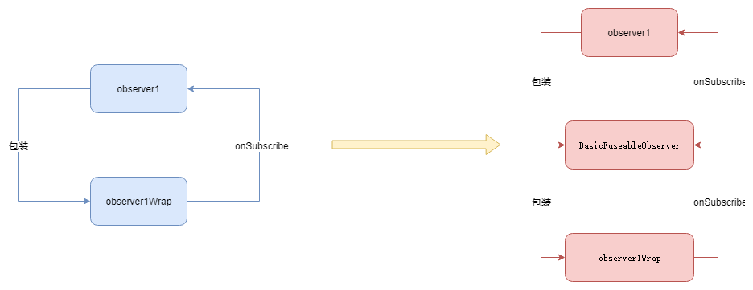

## RxJava2 源码分析（四）

### 目的

本文主要分析操作符的实现原理，关于操作符的使用不做讲解，想了解的可以参考[Github上的例子项目](<https://github.com/amitshekhariitbhu/RxJava2-Android-Samples>)以及[官方文档](<http://reactivex.io/documentation/operators.html>)。


### 从一个例子开始

这里我们以最常用的 map 为例。首先我们写一个demo：

> Demo
>
> 这个demo演示了如何将一个int转成string。Kotlin 赛高！！！
>
> 虽然看起来没有什么屌用，但是如果int值是一个图片的资源id，我们要将这个id转成一个Bitmap，那么也可以用map操作法，再配上前几篇文章说的线程切换，岂不美哉！~

```kotlin
        Observable.just(1).map {
            // map 的作用主要是做一个变化，这里是将发射的 int 值变成 string
            "$it-covert"
        }.subscribe {
            // 打印接收到的 string
            System.out.println(it)
        }
```

这个为了简单我用到了 just 操作符，其实和 create 差不多，如果你强迫症想搞清楚，可以自己戳戳源码，前面的文章如果你真的看懂了，戳进去几分钟就知道它的原理啦。

这里我们直接从 map 方法开始分析：

#### Observable

> Observable

```java
    public final <R> Observable<R> map(Function<? super T, ? extends R> mapper) {
        ObjectHelper.requireNonNull(mapper, "mapper is null");
        return RxJavaPlugins.onAssembly(new ObservableMap<T, R>(this, mapper));
    }
```

按住 ctrl 键，点击鼠标左键：

#### ObservableMap

> 类结构
>
> 它也是继承了 AbstractObservableWithUpstream，这个是我们的老相好了，就不介绍了

```java
public final class ObservableMap<T, U> extends AbstractObservableWithUpstream<T, U> {...}
```


下面看构造函数：

> 构造函数

```java
    public ObservableMap(ObservableSource<T> source, Function<? super T, ? extends U> function) {
        // source 不多说
        super(source);
        // 这里就是我们做变换的函数
        this.function = function;
    }
```


接下来就是看 `subscribeActual` 方法了，看，只要掌握了套路，分析起源码来，还是比较轻松的。

> subscribeActual 方法

```java
    @Override
    public void subscribeActual(Observer<? super U> t) {
        source.subscribe(new MapObserver<T, U>(t, function));
    }
```

这个方法很直接，不做作，直接将 t 与 functiaon 全部扔进 MapObserver 里面，交给 MapObserver 去处理。下面来分析分析 MapObserver 这个类。


#### ObservableMap.MapObserver

> 类结构
>
> MapObserver 继承了 BasicFuseableObserver

```java
    static final class MapObserver<T, U> extends BasicFuseableObserver<T, U> {...}
```


#### BasicFuseableObserver

书里说过，信息太多与信息太少，都会对理解力造成阻碍。

这个类的蛋疼之处就在于，里面的代码不多，很简单，但是又没简单到你可以一下子就能明白这个类的作用。所以如果我把这个类的代码贴出来，作用也不大，我说不出一个道道来。

这里我说一下我自己对这个类的理解：

```java
Base class for a fuseable intermediate observer.
```

上面的一串英文是类的注释，翻译过来就是说 **一个用于可融合的中间观察者的基类**，反正我还是没太明白。

既然它是一个中间观察者，我们就看看它作为一个“中介”，搞了一些啥事情。

> BasicFuseableObserver#onSubscribe
>
> 在这个方法里面，它作为第三者，插入到了原来的 parent 与 observer 之间

```java
    @Override
    public final void onSubscribe(Disposable s) {
        // 该方法用于判断 this.s 为 null，并且 s 不为 null
        if (DisposableHelper.validate(this.s, s)) {

            // 这行代码很重要
            this.s = s;
            
            // QueueDisposable 是一个接口，后面会讲
            if (s instanceof QueueDisposable) {
                this.qs = (QueueDisposable<T>)s;
            }

            // 这里有两个钩子
            if (beforeDownstream()) {

                // 调用了 actual 的 onSubscribe
                // 这个方法我们在之前分析 subscribeActual 方法的时候，都是跳过的
                // 下面我们会分析这个方法的作用
                actual.onSubscribe(this);

                afterDownstream();
            }

        }
    }
```

由于在之前的文章中，我们忽略了 onSubscribe，而这个类用到了这个方法，所以现在我们拿 ObservableCreate 来分析一下 onSubscribe 这个方法的作用。

#### ObservableCreate

> ObservableCreate#subscribeActual

```java
    @Override
    protected void subscribeActual(Observer<? super T> observer) {
        CreateEmitter<T> parent = new CreateEmitter<T>(observer);
        observer.onSubscribe(parent);

        ...
    }
```

其实从这两行代码就可以看出，onSubscribe 的参数就是我们的老父亲 parent。

之前我们说过，CreateEmitter 就是将 observer 包装了一下，即 CreateEmitter 持有 observer 。

现在看 onSubscribe 方法就是反过来，即 observer  “参数持有” CreateEmitter 。



让我们再次回到 BasicFuseableObserver 类中的 onSubscribe 方法里面：

####BasicFuseableObserver

> BasicFuseableObserver#onSubscribe

```java
// 这行代码很重要
// s 是原来的 parent，它把这个对象保存起来
this.s = s;

// actual 是我们 demo 中创建的匿名内部类（虽然真正的情况是将 consumer 包成了 observer）
// 将 this 作为 parent 传递进去
// 所以，这样他就成了一个中间观察者
actual.onSubscribe(this);
```

上面的代码，你可以联想一下链表的插入操作。

**前面的文章里面，onSubscribe 的调用都是放在 subscribeActual 中的，这里为啥要放到 Observer 类里面呢**？我猜想是因为操作符会导致数据源的不稳定（同步，异步数据），因为 BasicFuseableObserver 还实现了 QueueDisposable 这个接口，这个接口类注释比较多，可以详细看看。


那么，分析到了这里，我们就将 MapObserver 当作一个普通的 Observer 的包装类来看待吧。反正这里我们还用不到里面的 poll 方法。

#### ObservableMap.MapObserver

我们直接看 onNext 方法：

> onNext
>
> 这里该方法由 MapObserver 的包装类调用，我们了解了套路，更不需要从头跟踪源码，就知道它由谁调用。只要知道它会被调用，在具体的代码中会被谁调用，分析源码的时候管他调用者是谁呢。

```java
        @Override
        public void onNext(T t) {
            if (done) {
                return;
            }

            // 在这个 demo 中，sourceMode 一直为 NONE
            if (sourceMode != NONE) {
                actual.onNext(null);
                return;
            }

            U v;

            try {
                // 这里就执行变化了，注意变换结果不能返回null
                v = ObjectHelper.requireNonNull(mapper.apply(t), "The mapper function returned a null value.");
            } catch (Throwable ex) {
                fail(ex);
                return;
            }
            // 将变化的结果返回
            actual.onNext(v);
        }
```

嗯，到这里，demo的流程就分析完了，还是很简单的，主要是例子简单。

其实，该类还有一个 poll 方法，应该会在某些情况下调用，这里没有用到，里面的水应该还有点深。

其他的操作符，这里就不讲了。