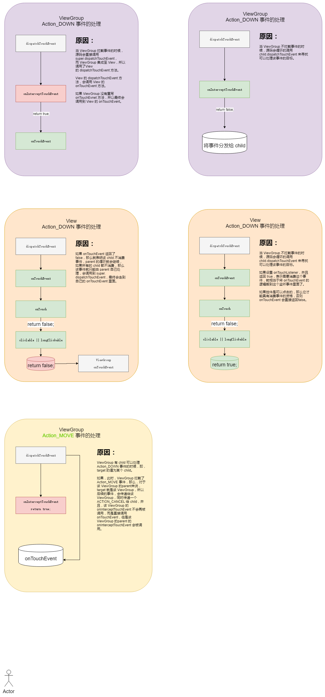

# ViewGroup的事件分发机制

之前的某一篇文章中分析过，Android屏幕的触摸事件最终会传递到Activity的dispatchTouchEvent()方法。


文章分析的源码是Android 2.2的源码。


那么就从这个方法开始，在重新梳理一遍事件分发流程。

```java
    public boolean dispatchTouchEvent(MotionEvent ev) {
        
		//是个空的方法, 我们直接跳过这里看下面的实现
        if (ev.getAction() == MotionEvent.ACTION_DOWN) {
            onUserInteraction();
        }
        if (getWindow().superDispatchTouchEvent(ev)) {
            return true;
        }
        //如果getWindow().superDispatchTouchEvent(ev)返回false，这个事件就交给Activity
		//来处理， Activity的onTouchEvent()方法直接返回了false
        return onTouchEvent(ev);
    }
```

这个方法中我们还是比较关心getWindow()的superDispatchTouchEvent()方法，getWindow()返回当前Activity的顶层窗口Window对象，我们直接看Window API的superDispatchTouchEvent()方法：

```java
public abstract boolean superDispatchTouchEvent(MotionEvent event);
```

Window的唯一子类是PhoneWindow,我们就看看PhoneWindow的superDispatchTouchEvent()方法：

```java
    @Override
    public boolean superDispatchTouchEvent(MotionEvent event) {
        return mDecor.superDispatchTouchEvent(event);
    }
```

里面直接调用DecorView类的superDispatchTouchEvent()方法。

```java
    public boolean superDispatchTouchEvent(MotionEvent event) {
        return super.dispatchTouchEvent(event);
    }
```

在里面调用了父类FrameLayout的dispatchTouchEvent()方法，而FrameLayout中并没有dispatchTouchEvent()方法，所以我们直接看ViewGroup的dispatchTouchEvent()方法：

```java

    @Override
    public boolean dispatchTouchEvent(MotionEvent ev) {
        final int action = ev.getAction();
        final float xf = ev.getX();
        final float yf = ev.getY();
        final float scrolledXFloat = xf + mScrollX;
        final float scrolledYFloat = yf + mScrollY;
        final Rect frame = mTempRect;
 
        //这个值默认是false, 然后我们可以通过requestDisallowInterceptTouchEvent(boolean disallowIntercept)方法
        //来改变disallowIntercept的值
        boolean disallowIntercept = (mGroupFlags & FLAG_DISALLOW_INTERCEPT) != 0;
 
        //这里是ACTION_DOWN的处理逻辑
        if (action == MotionEvent.ACTION_DOWN) {
        	//清除mMotionTarget, 每次ACTION_DOWN都设置mMotionTarget为null
            if (mMotionTarget != null) {
                mMotionTarget = null;
            }
 
            //disallowIntercept默认是false, 就看ViewGroup的onInterceptTouchEvent()方法
            if (disallowIntercept || !onInterceptTouchEvent(ev)) {
                ev.setAction(MotionEvent.ACTION_DOWN);
                final int scrolledXInt = (int) scrolledXFloat;
                final int scrolledYInt = (int) scrolledYFloat;
                final View[] children = mChildren;
                final int count = mChildrenCount;
                //遍历其子View
                for (int i = count - 1; i >= 0; i--) {
                    final View child = children[i];
                    
                    //如果该子View是VISIBLE或者该子View正在执行动画, 表示该View才
                    //可以接受到Touch事件
                    if ((child.mViewFlags & VISIBILITY_MASK) == VISIBLE
                            || child.getAnimation() != null) {
                    	//获取子View的位置范围
                        child.getHitRect(frame);
                        
                        //如Touch到屏幕上的点在该子View上面
                        if (frame.contains(scrolledXInt, scrolledYInt)) {
                            // offset the event to the view's coordinate system
                            final float xc = scrolledXFloat - child.mLeft;
                            final float yc = scrolledYFloat - child.mTop;
                            ev.setLocation(xc, yc);
                            child.mPrivateFlags &= ~CANCEL_NEXT_UP_EVENT;
                            
                            //调用该子View的dispatchTouchEvent()方法
                            if (child.dispatchTouchEvent(ev))  {
                                // 如果child.dispatchTouchEvent(ev)返回true表示
                            	//该事件被消费了，设置mMotionTarget为该子View
                                mMotionTarget = child;
                                //直接返回true
                                return true;
                            }
                            // The event didn't get handled, try the next view.
                            // Don't reset the event's location, it's not
                            // necessary here.
                        }
                    }
                }
            }
        }
 
        //判断是否为ACTION_UP或者ACTION_CANCEL
        boolean isUpOrCancel = (action == MotionEvent.ACTION_UP) ||
                (action == MotionEvent.ACTION_CANCEL);
 
        if (isUpOrCancel) {
            //如果是ACTION_UP或者ACTION_CANCEL, 将disallowIntercept设置为默认的false
        	//假如我们调用了requestDisallowInterceptTouchEvent()方法来设置disallowIntercept为true
        	//当我们抬起手指或者取消Touch事件的时候要将disallowIntercept重置为false
        	//所以说上面的disallowIntercept默认在我们每次ACTION_DOWN的时候都是false
            mGroupFlags &= ~FLAG_DISALLOW_INTERCEPT;
        }
 
        // The event wasn't an ACTION_DOWN, dispatch it to our target if
        // we have one.
        final View target = mMotionTarget;
        //mMotionTarget为null意味着没有找到消费Touch事件的View, 所以我们需要调用ViewGroup父类的
        //dispatchTouchEvent()方法，也就是View的dispatchTouchEvent()方法
        if (target == null) {
            // We don't have a target, this means we're handling the
            // event as a regular view.
            ev.setLocation(xf, yf);
            if ((mPrivateFlags & CANCEL_NEXT_UP_EVENT) != 0) {
                ev.setAction(MotionEvent.ACTION_CANCEL);
                mPrivateFlags &= ~CANCEL_NEXT_UP_EVENT;
            }
            return super.dispatchTouchEvent(ev);
        }
 
        //这个if里面的代码ACTION_DOWN不会执行，只有ACTION_MOVE
        //ACTION_UP才会走到这里, 假如在ACTION_MOVE或者ACTION_UP拦截的
        //Touch事件, 将ACTION_CANCEL派发给target，然后直接返回true
        //表示消费了此Touch事件
        if (!disallowIntercept && onInterceptTouchEvent(ev)) {
            final float xc = scrolledXFloat - (float) target.mLeft;
            final float yc = scrolledYFloat - (float) target.mTop;
            mPrivateFlags &= ~CANCEL_NEXT_UP_EVENT;
            ev.setAction(MotionEvent.ACTION_CANCEL);
            ev.setLocation(xc, yc);
            
            if (!target.dispatchTouchEvent(ev)) {
            }
            // clear the target
            mMotionTarget = null;
            // Don't dispatch this event to our own view, because we already
            // saw it when intercepting; we just want to give the following
            // event to the normal onTouchEvent().
            return true;
        }
 
        if (isUpOrCancel) {
            mMotionTarget = null;
        }
 
        // finally offset the event to the target's coordinate system and
        // dispatch the event.
        final float xc = scrolledXFloat - (float) target.mLeft;
        final float yc = scrolledYFloat - (float) target.mTop;
        ev.setLocation(xc, yc);
 
        if ((target.mPrivateFlags & CANCEL_NEXT_UP_EVENT) != 0) {
            ev.setAction(MotionEvent.ACTION_CANCEL);
            target.mPrivateFlags &= ~CANCEL_NEXT_UP_EVENT;
            mMotionTarget = null;
        }
 
        //如果没有拦截ACTION_MOVE, ACTION_DOWN的话，直接将Touch事件派发给target
        return target.dispatchTouchEvent(ev);
    }

```


为了更清晰的理清楚整个流程，我们举一个例子。

假设我们有这样的一个布局：

```xml
<RelativeLayout xmlns:android="http://schemas.android.com/apk/res/android"
    xmlns:tools="http://schemas.android.com/tools"
    android:layout_width="match_parent"
    android:layout_height="match_parent"
    tools:context=".MainActivity" >
 
    <TextView
        android:layout_width="wrap_content"
        android:layout_height="wrap_content"
        android:layout_centerHorizontal="true"
        android:layout_centerVertical="true"
        android:text="@string/hello_world" />
 
</RelativeLayout>
```


那么，activity的布局层次是这样的：


我们看到最顶层就是PhoneWindow$DecorView，接着DecorView下面有一个LinearLayout， LinearLayout下面有两个FrameLayout。

上面那个FrameLayout是用来显示标题栏的，这个Demo中是一个TextView,当然我们还可以定制我们的标题栏，利用getWindow().setFeatureInt(Window.FEATURE_CUSTOM_TITLE,R.layout.XXX); xxx就是我们自定义标题栏的布局XML文件。

下面的FrameLayout是用来装载ContentView的，也就是我们在Activity中利用setContentView()方法设置的View，现在我们知道了，原来我们利用setContentView()设置Activity的View的外面还嵌套了这么多的东西。


我们点击屏幕上面的TextView来看看Touch是如何分发的，先看看ACTION_DOWN。

在DecorView这一层会直接调用ViewGroup的dispatchTouchEvent(), 先看18行，每次ACTION_DOWN都会将mMotionTarget设置为null, mMotionTarget是什么？我们先不管，继续看代码，走到25行,  disallowIntercept默认为false，我们再看ViewGroup的onInterceptTouchEvent()方法。

```java
public boolean onInterceptTouchEvent(MotionEvent ev) {
	return false;
}
```

直接返回false, 继续往下看：

循环遍历DecorView里面的Child，从上面的MainActivity的层次结构图我们可以看出，DecorView里面只有一个Child那就是LinearLayout。

第43行判断Touch的位置在不在LinnearLayout上面，这毫无疑问是在的，所以直接跳到51行。

调用LinearLayout的dispatchTouchEvent()方法。

LinearLayout也没有dispatchTouchEvent()这个方法，所以也是调用ViewGroup的dispatchTouchEvent()方法，**所以这个方法卡在51行没有继续下去**（**这里的意思是DecorView的流程暂时告一段落，事件传递给了LinearLayout**），而是去先执行LinearLayout的dispatchTouchEvent()。

LinearLayout调用dispatchTouchEvent()的逻辑跟DecorView是一样的，所以也是遍历LinearLayout的两个FrameLayout，判断Touch的是哪个FrameLayout，很明显是下面那个，调用下面那个FrameLayout的dispatchTouchEvent(),  **所以LinearLayout的dispatchTouchEvent()卡在51也没继续下去**。

执行RelativeLayout的dispatchTouchEvent()方法逻辑还是一样的，循环遍历 RelativeLayout里面的孩子，里面只有一个TextView, 所以这里就调用TextView的dispatchTouchEvent()。

TextView并没有dispatchTouchEvent()这个方法，于是找TextView的父类View。

在看View的dispatchTouchEvent()的方法之前，我们先理清下上面这些ViewGroup执行dispatchTouchEvent()的思路，我画了一张图帮大家理清下（这里没有画出onInterceptTouchEvent() 方法）


上面的ViewGroup的Touch事件分发就告一段落先，因为这里要调用TextView（也就是View）的dispatchTouchEvent()方法，所以我们先分析View的dispatchTouchEvent()方法在将上面的继续下去。


### View的Touch事件分发机制

我们还是先看View的dispatchTouchEvent()方法的源码：

```java
	public boolean dispatchTouchEvent(MotionEvent event) {
        if (mOnTouchListener != null && (mViewFlags & ENABLED_MASK) == ENABLED &&
                mOnTouchListener.onTouch(this, event)) {
            return true;
        }
        return onTouchEvent(event);
    }
```

在这个方法里面，先进行了一个判断:

第一个条件mOnTouchListener就是我们调用View的setTouchListener()方法设置的

第二个条件是判断View是否为enabled的， View一般都是enabled，除非你手动设置为disabled

第三个条件就是OnTouchListener接口的onTouch()方法的返回值了，如果调用了setTouchListener()设置OnTouchListener，并且onTouch()方法返回true，View的dispatchTouchEvent()方法就直接返回true,否则就执行View的onTouchEvent() 并返回View的onTouchEvent()的值

现在你了解了View的onTouchEvent()方法和onTouch()的关系了吧！为什么Android提供了处理Touch事件onTouchEvent()方法还要增加一个OnTouchListener接口呢？我觉得OnTouchListener接口是对处理Touch事件的屏蔽和扩展作用吧。

我们再看View的onTouchEvent()方法：

```java
  	public boolean onTouchEvent(MotionEvent event) {
        final int viewFlags = mViewFlags;
 
        if ((viewFlags & ENABLED_MASK) == DISABLED) {
            return (((viewFlags & CLICKABLE) == CLICKABLE ||
                    (viewFlags & LONG_CLICKABLE) == LONG_CLICKABLE));
        }
 
        //如果设置了Touch代理，就交给代理来处理，mTouchDelegate默认是null
        if (mTouchDelegate != null) {
            if (mTouchDelegate.onTouchEvent(event)) {
                return true;
            }
        }
 
        //如果View是clickable或者longClickable的onTouchEvent就返回true, 否则返回false
        if (((viewFlags & CLICKABLE) == CLICKABLE ||
                (viewFlags & LONG_CLICKABLE) == LONG_CLICKABLE)) {
            switch (event.getAction()) {
                case MotionEvent.ACTION_UP:
                    boolean prepressed = (mPrivateFlags & PREPRESSED) != 0;
                    if ((mPrivateFlags & PRESSED) != 0 || prepressed) {
                        boolean focusTaken = false;
                        if (isFocusable() && isFocusableInTouchMode() && !isFocused()) {
                            focusTaken = requestFocus();
                        }
 
                        if (!mHasPerformedLongPress) {
                            removeLongPressCallback();
 
                            if (!focusTaken) {
                                if (mPerformClick == null) {
                                    mPerformClick = new PerformClick();
                                }
                                if (!post(mPerformClick)) {
                                    performClick();
                                }
                            }
                        }
 
                        if (mUnsetPressedState == null) {
                            mUnsetPressedState = new UnsetPressedState();
                        }
 
                        if (prepressed) {
                            mPrivateFlags |= PRESSED;
                            refreshDrawableState();
                            postDelayed(mUnsetPressedState,
                                    ViewConfiguration.getPressedStateDuration());
                        } else if (!post(mUnsetPressedState)) {
                            mUnsetPressedState.run();
                        }
                        removeTapCallback();
                    }
                    break;
 
                case MotionEvent.ACTION_DOWN:
                    if (mPendingCheckForTap == null) {
                        mPendingCheckForTap = new CheckForTap();
                    }
                    mPrivateFlags |= PREPRESSED;
                    mHasPerformedLongPress = false;
                    postDelayed(mPendingCheckForTap, ViewConfiguration.getTapTimeout());
                    break;
 
                case MotionEvent.ACTION_CANCEL:
                    mPrivateFlags &= ~PRESSED;
                    refreshDrawableState();
                    removeTapCallback();
                    break;
 
                case MotionEvent.ACTION_MOVE:
                    final int x = (int) event.getX();
                    final int y = (int) event.getY();
 
                    //当手指在View上面滑动超过View的边界，
                    int slop = mTouchSlop;
                    if ((x < 0 - slop) || (x >= getWidth() + slop) ||
                            (y < 0 - slop) || (y >= getHeight() + slop)) {
                        // Outside button
                        removeTapCallback();
                        if ((mPrivateFlags & PRESSED) != 0) {
                            removeLongPressCallback();
 
                            mPrivateFlags &= ~PRESSED;
                            refreshDrawableState();
                        }
                    }
                    break;
            }
            return true;
        }
 
        return false;
    }
```

这个方法也是比较长的，我们先看第4行

如果一个View是disabled, 并且该View是Clickable或者longClickable， onTouchEvent()就不执行下面的代码逻辑直接返回true, 表示该View就一直消费Touch事件，如果一个enabled的View,并且是clickable或者longClickable的，onTouchEvent()会执行下面的代码逻辑并返回true。

综上，一个clickable或者longclickable的View是一直消费Touch事件的。

而**一般的View既不是clickable也不是longclickable的**（即不会消费Touch事件，只会执行ACTION_DOWN而不会执行ACTION_MOVE和ACTION_UP）。

**Button是clickable的**，可以消费Touch事件，但是我们可以通过setClickable()和setLongClickable()来设置View是否为clickable和longClickable。当然还可以通过重写View的onTouchEvent()方法来控制Touch事件的消费与否。


我们再看57行的ACTION_DOWN, 新建了一个CheckForTap，我们看看CheckForTap是什么。

```java
 	private final class CheckForTap implements Runnable {
        public void run() {
            mPrivateFlags &= ~PREPRESSED;
            mPrivateFlags |= PRESSED;
            refreshDrawableState();
            if ((mViewFlags & LONG_CLICKABLE) == LONG_CLICKABLE) {
                postCheckForLongClick(ViewConfiguration.getTapTimeout());
            }
        }
    }
```

原来是个Runnable对象。

然后使用Handler的post方法延时ViewConfiguration.getTapTimeout()执行CheckForTap的run()方法，在run方法中先判断view是否longClickable的,一般的View都是false。

postCheckForLongClick(ViewConfiguration.getTapTimeout())这段代码就是执行长按的逻辑的代码，只有当我们设置为longClickble才会去执行postCheckForLongClick(ViewConfiguration.getTapTimeout())，这里我就不介绍了。

**PS：这里的原理其实是Android中非常常见的**

> 使用 Handler post 一个延时 xxx ms消息，如果收到这个延时消息就会触发一个事件。 然而某些情况下，会提前将该消息 remove 掉，这样就收不到这个消息，无法触发事件。
>
> 拿长按事件举例：比如长按1s算一个长按事件，那么我们就可以post一个延时1000ms的消息，收到这个消息就触发长按回调，如果没到1s用户就放开了手指，那么就移除这个消息，这样就不会触发长按回调了。

长按事件是在ACTION_DOWN中执行，点击事件是在ACTION_UP中执行，要想执行长按事件，这个View必须是longclickable的， 也许你会纳闷，一般的View不是longClickable为什么也会执行长按事件呢？我们要执行长按事件必须要调用setOnLongClickListener()设置OnLongClickListener接口，我们看看这个方法的源码：

```java
   	public void setOnLongClickListener(OnLongClickListener l) {
        if (!isLongClickable()) {
            setLongClickable(true);
        }
        mOnLongClickListener = l;
    }
```

看到没有，如果这个View不是longClickable的，我们就调用setLongClickable(true)方法设置为longClickable的,所以才会去执行长按方法onLongClick();

要想执行点击事件，**这个View就必须要消费ACTION_DOWN和ACTION_MOVE事件，并且没有设置OnLongClickListener的情况下。**

**如果设置了OnLongClickListener的情况下，需要onLongClick()返回false才能执行到onClick()方法**（现在我终于明白了了为什么 OnLongClickListener 会有一个返回值！！长按事件是点击事件的一种特殊情况，既然要判断特殊情况，需要一个返回值也是一种思路），也许你又会纳闷，一般的View默认是不消费touch事件的，这不是和你上面说的相违背嘛，我们要想执行点击事件必须要调用setOnClickListener()来设置OnClickListener接口，我们看看这个方法的源码就知道了。

```java
   	public void setOnClickListener(OnClickListener l) {
        if (!isClickable()) {
            setClickable(true);
        }
        mOnClickListener = l;
    }
```

所以说一个enable的并且是clickable的View是一直消费touch事件的，所以才会执行到 onClick() 方法。

对于View的Touch事件的分发机制算是告一段落了，从上面我们可以得出TextView的dispatchTouchEvent() 方法返回false，即不消费Touch事件。

我们就要往上看RelativeLayout的dispatchTouchEvent()方法的51行，由于TextView.dispatchTouchEvent()为false, 导致mMotionTarget没有被赋值，还是null, 继续往下走。

执行RelativeLayout的dispatchTouchEvent()方法, 来到第84行， 判断target是否为null，这个target就是mMotionTarget，满足条件。

执行92行的 super.dispatchTouchEvent(ev)代码并返回， 这里调用的是RelativeLayout父类View的dispatchTouchEvent()方法。

由于RelativeLayout没有设置onTouchListener, 所以这里直接调用RelativeLayout（其实就是View， 因为RelativeLayout没有重写onTouchEvent()）的onTouchEvent()方法 。

由于RelativeLayout既不是clickable的也是longClickable的，所以其onTouchEvent()方法false, RelativeLayout的dispatchTouchEvent()也是返回false,这里就执行完了RelativeLayout的dispatchTouchEvent()方法。

继续执行FrameLayout的dispatchTouchEvent()的第51行，由于RelativeLayout.dispatchTouchEvent()返回的是false, **跟上面的逻辑是一样的**， 也是执行到92行的super.dispatchTouchEvent(ev)代码并返回，然后执行FrameLayout的onTouchEvent()方法，而FrameLayout的onTouchEvent()也是返回false,所以FrameLayout的dispatchTouchEvent()方法返回false,执行完毕FrameLayout的dispatchTouchEvent()方法。

画了个图来帮大家理解下（这里没有画出onInterceptTouchEvent（）方法）：


所以我们点击屏幕上面的TextView的事件分发流程是上图那个样子的，表示Activity的View都不消费ACTION_DOWN事件，**所以就不能在触发ACTION_MOVE, ACTION_UP等事件了**，具体是为什么？我还不太清楚，毕竟从Activity到TextView这一层是分析不出来的，估计是在底层实现的。

> So, if you return false when the down action event is received, you indicate that you have not consumed the event and are also not interested in subsequent actions from this event. Thus, you will not be called for any other actions within the event, such as a finger gesture, **or the eventual up action event.**


但如果将TextView换成Button，流程是不是还是这个样子呢？答案不是,我们来分析分析一下。

如果是Button , Button是一个clickable的View，onTouchEvent()返回true, 表示他一直消费Touch事件。

所以Button的dispatchTouchEvent()方法返回true, 回到RelativeLayout的dispatchTouchEvent()方法的51行。

满足条件，进入到if方法体，设置mMotionTarget为Button，然后直接返回true。

RelativeLayout的dispatchTouchEvent()方法执行完毕, **不会调用到RelativeLayout的onTouchEvent()方法**。

然后到FrameLayout的dispatchTouchEvent()方法的51行，由于RelativeLayout.dispatchTouchEvent()返回true。

 满足条件，进入if方法体，设置mMotionTarget为RelativeLayout，注意下，**这里的mMotionTarget跟RelativeLayout的dispatchTouchEvent()方法的mMotionTarget不是同一个哦**，因为他们是不同的方法中的，然后返回true。

同理FrameLayout的dispatchTouchEvent()也是返回true， DecorView的dispatchTouchEvent()方法也返回true， 还是画一个流程图（这里没有画出onInterceptTouchEvent（）方法）给大家理清下：


从上面的流程图得出一个结论，Touch事件是从顶层的View一直往下分发到手指按下的最里面的View，如果这个View的onTouchEvent()返回false,即不消费Touch事件，这个Touch事件就会向上找父布局调用其父布局的onTouchEvent()处理，如果这个View返回true,表示消费了Touch事件，就不调用父布局的onTouchEvent()。


接下来我们用一个自定义的ViewGroup来替换RelativeLayout,自定义ViewGroup代码如下：

```java
package com.example.androidtouchevent;
 
import android.content.Context;
import android.util.AttributeSet;
import android.view.MotionEvent;
import android.widget.RelativeLayout;
 
public class CustomLayout extends RelativeLayout {
	
	public CustomLayout(Context context, AttributeSet attrs) {
		super(context, attrs, 0);
	}
 
	public CustomLayout(Context context, AttributeSet attrs, int defStyle) {
		super(context, attrs, defStyle);
	}
 
	@Override
	public boolean onTouchEvent(MotionEvent event) {
		return super.onTouchEvent(event);
	}
 
	@Override
	public boolean onInterceptTouchEvent(MotionEvent ev) {
		return true;
	}
	
}
```

我们就重写了onInterceptTouchEvent(),返回true, RelativeLayout默认是返回false, 然后再CustomLayout布局中加一个Button ,如下图：


我们这次不从DecorView的dispatchTouchEvent()分析了，直接从CustomLayout的dispatchTouchEvent()分析。

我们先看ACTION_DOWN 来到25行，由于我们重写了onInterceptTouchEvent()返回true， 所以不走这个if里面。

直接往下看代码,来到84行， target为null,所以进入if方法里面，直接调用super.dispatchTouchEvent()方法， 也就是View的dispatchTouchEvent()方法，而在View的dispatchTouchEvent()方法中是直接调用View的onTouchEvent()方法，但是CustomLayout重写了onTouchEvent()，所以这里还是调用CustomLayout的onTouchEvent()， 这个方法返回false, 不消费Touch事件，所以不会在触发ACTION_MOVE,ACTION_UP等事件了，这里我再画一个流程图吧（含有onInterceptTouchEvent()方法的）。


好了，就分析到这里吧，差不多分析完了，还有一种情况没有分析到，例如我将CustomLayout的代码改成下面的情形，Touch事件又是怎么分发的呢？我这里就不带大家分析了。

```java
package com.example.androidtouchevent;
 
import android.content.Context;
import android.util.AttributeSet;
import android.view.MotionEvent;
import android.widget.RelativeLayout;
 
public class CustomLayout extends RelativeLayout {
	
	public CustomLayout(Context context, AttributeSet attrs) {
		super(context, attrs, 0);
	}
 
	public CustomLayout(Context context, AttributeSet attrs, int defStyle) {
		super(context, attrs, defStyle);
	}
 
	@Override
	public boolean onTouchEvent(MotionEvent event) {
		return super.onTouchEvent(event);
	}
 
	@Override
	public boolean onInterceptTouchEvent(MotionEvent ev) {
		if(ev.getAction() == MotionEvent.ACTION_MOVE){
			return true;
		}
		return super.onInterceptTouchEvent(ev);
	}
	
}
```

这篇文章的篇幅有点长，如果你想了解Touch事件的分发机制，你一定要认真看完，下面来总结一下吧
1.Activity的最顶层Window是PhoneWindow，PhoneWindow的最顶层View是DecorView

2.一个clickable或者longClickable的View会永远消费Touch事件，不管他是enabled还是disabled的

3.View的长按事件是在ACTION_DOWN中执行，要想执行长按事件该View必须是longClickable的，并且不能产生ACTION_MOVE

4.View的点击事件是在ACTION_UP中执行，想要执行点击事件的前提是消费了ACTION_DOWN和ACTION_MOVE,并且没有设置OnLongClickListener的情况下，如设置了OnLongClickListener的情况，则必须使onLongClick()返回false

5.如果View设置了onTouchListener了，并且onTouch()方法返回true，则不执行View的onTouchEvent()方法，也表示View消费了Touch事件，返回false则继续执行onTouchEvent()

6.Touch事件是从最顶层的View一直分发到手指touch的最里层的View,如果最里层View消费了ACTION_DOWN事件（设置onTouchListener，并且onTouch()返回true 或者onTouchEvent()方法返回true）才会触发ACTION_MOVE,ACTION_UP的发生,如果某个ViewGroup拦截了Touch事件，则Touch事件交给ViewGroup处理

7.Touch事件的分发过程中，如果消费了ACTION_DOWN,而在分发ACTION_MOVE的时候,某个ViewGroup拦截了Touch事件，就像上面那个自定义CustomLayout，则会将ACTION_CANCEL分发给该ViewGroup下面的Touch到的View,然后将Touch事件交给ViewGroup处理，并返回true。


总结：




出一个题目：

有这样一个布局：

```xml
    <com.jacob.viewdraghelper.MotionGroupView
        android:layout_width="match_parent"
        android:layout_height="wrap_content">
        <com.jacob.viewdraghelper.MotionView
            android:clickable="true"                              
            android:id="@+id/motion_view"
            android:layout_width="match_parent"
            android:layout_height="100dp"
            android:background="@android:color/black" />
    </com.jacob.viewdraghelper.MotionGroupView>
```

```java
public class MotionGroupView extends LinearLayout {

    private static final String TAG = "MotionGroupView";

    public MotionGroupView(Context context, AttributeSet attrs) {
        super(context, attrs);
    }

    @Override
    public boolean onInterceptTouchEvent(MotionEvent ev) {
        Log.e(TAG, "onInterceptTouchEvent: "+ ev.getAction());
        if (ev.getAction() == MotionEvent.ACTION_MOVE) {
            return true;
        }
        return super.onInterceptTouchEvent(ev);
    }

    @Override
    public boolean dispatchTouchEvent(MotionEvent ev) {
        Log.e(TAG, "dispatchTouchEvent: "+ ev.getAction());
        return super.dispatchTouchEvent(ev);
    }

    @Override
    public boolean onTouchEvent(MotionEvent event) {
        Log.e(TAG, "onTouchEvent: "+ event.getAction());
        return super.onTouchEvent(event);
    }
}

public class MotionView extends View {

    private static final String TAG = "MotionView";

    public MotionView(Context context, AttributeSet attrs) {
        super(context, attrs);
    }

    @SuppressLint("ClickableViewAccessibility")
    @Override
    public boolean onTouchEvent(MotionEvent event) {
        Log.e(TAG, "onTouchEvent: " + event.getAction());
        return super.onTouchEvent(event);
    }

    @Override
    public boolean dispatchTouchEvent(MotionEvent event) {
        Log.e(TAG, "dispatchTouchEvent: "+ event.getAction());
        return super.dispatchTouchEvent(event);
    }
}

```

请说说，手指按下并滑动的事件分发流程，要是能说出 ACTION_CANCEL 就更好了，注意xml设置了 clickable，如果没有设置 clickable 又会怎么样？

```shell
MotionGroupView: dispatchTouchEvent: 0
MotionGroupView: onInterceptTouchEvent: 0
MotionView: dispatchTouchEvent: 0
MotionView: onTouchEvent: 0
MotionGroupView: dispatchTouchEvent: 2
MotionGroupView: onInterceptTouchEvent: 2
MotionView: dispatchTouchEvent: 3
MotionView: onTouchEvent: 3
MotionGroupView: dispatchTouchEvent: 2
MotionGroupView: onTouchEvent: 2
MotionGroupView: dispatchTouchEvent: 2
MotionGroupView: onTouchEvent: 2
MotionGroupView: dispatchTouchEvent: 2
MotionGroupView: onTouchEvent: 2
MotionGroupView: dispatchTouchEvent: 1
MotionGroupView: onTouchEvent: 1
```


#### 参考链接

<https://blog.csdn.net/xiaanming/article/details/21696315>

