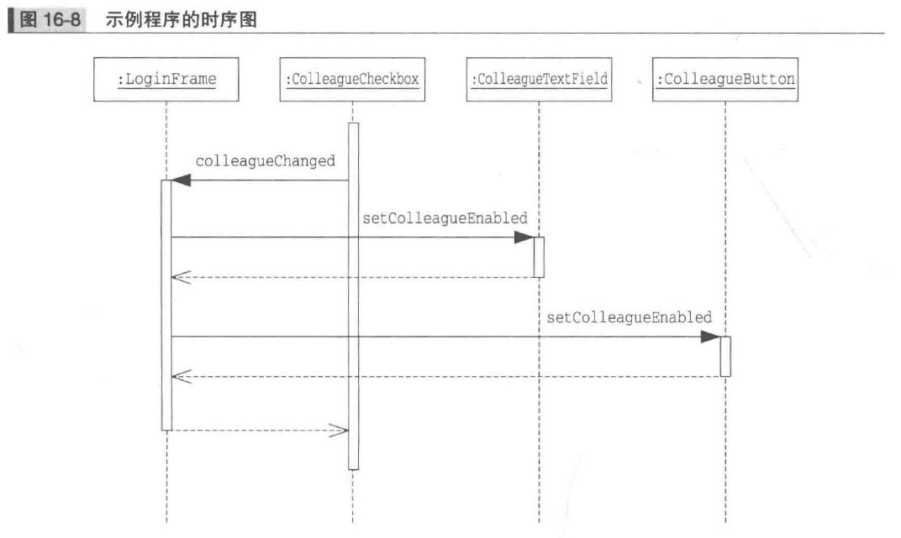
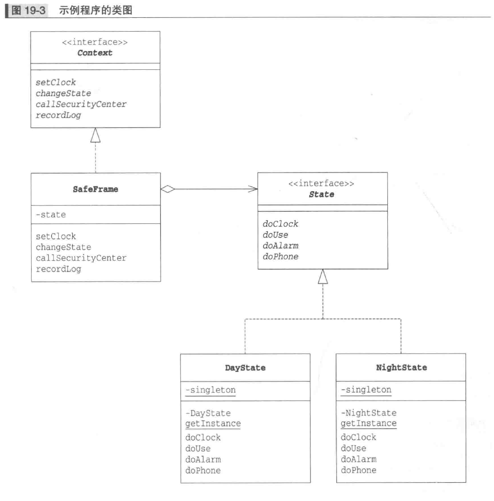

# 图解设计模式

## 适应设计模式

### 1. 迭代器模式

### 2. 适配器模式

## 交给子类

### 3. 模板模式

### 4. 工厂模式

## 生成实例

### 5. 单利模式 （略）

### 6. 原型模式

### 7. Builder模式

似乎与我们现在使用的有较大区别

### 8. 抽象工厂模式

## 分开考虑

### 9. Bridge 模式

### 10. Strategy 模式

## 一致性

### 11. Composite模式

### 12. Decorator 模式

## 访问数据结构

### 13. Visitor 模式

### 14. Chain of  Responsibility 模式

## 简单化

### 15. Facade 模式

### 16. Mediator 模式

## 管理状态

### 17. Observable 模式

### 18. Memento 模式

### 19. State 模式

## 避免浪费

### 20. FlyWeight 模式

### 21. Proxy 模式

该模式还可以用来做延迟初始化。

## 用类来表现

### 22. Command 模式

### 23. Interpreter 模式

