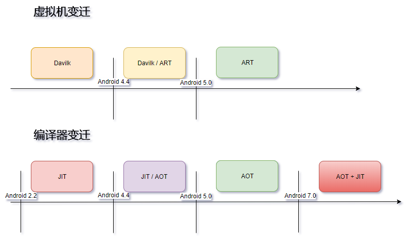
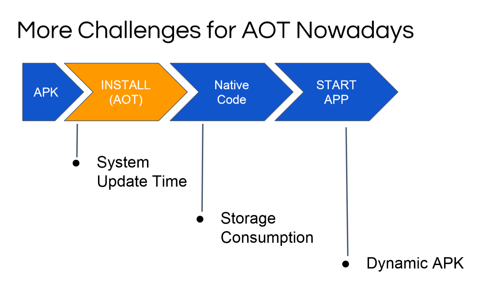
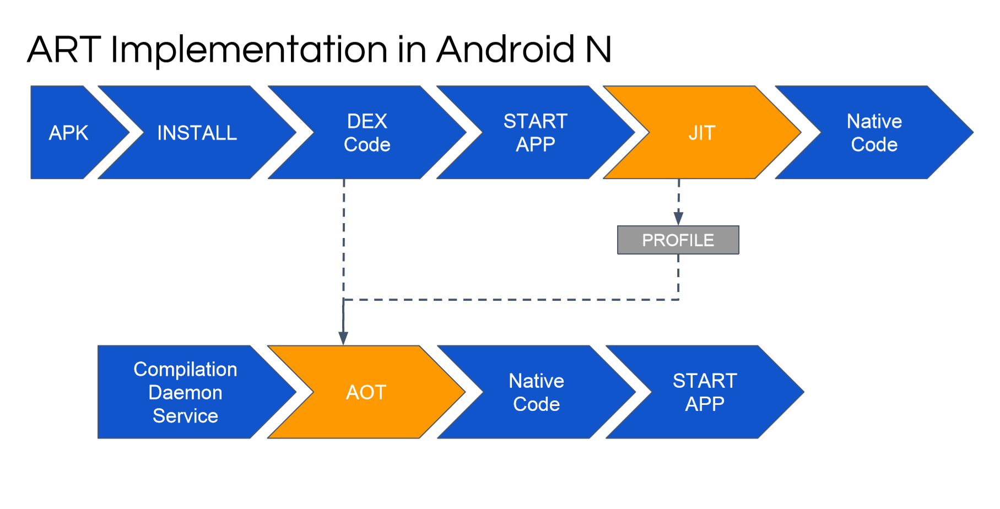
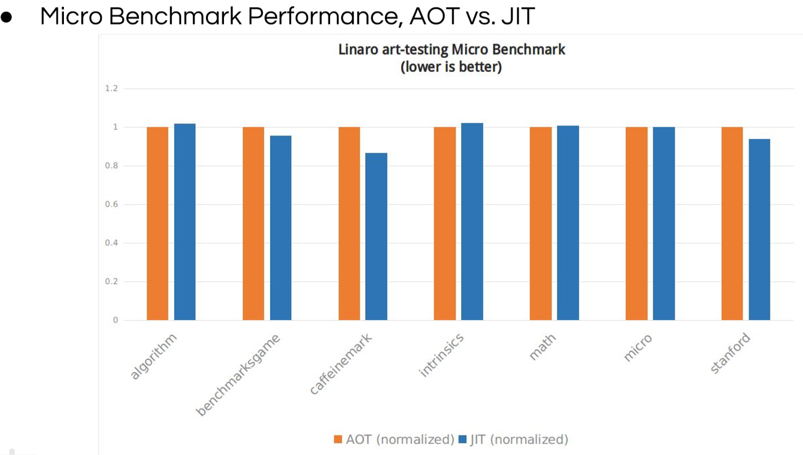

[TOC]

## Android 虚拟机与编译器的变迁



## 需要了解几个概念
-  Dalvik 虚拟机：负责解释dex文件为机器码，每次执行代码，都需要Dalvik将dex代码翻译为微处理器指令，然后交给系统处理，这样效率不高。
    
-  JIT(Just-In-Time)：为了解决上面的问题，Google在2.2版本添加了JIT编译器，当App运行时，每当遇到一个新类，JIT编译器就会对这个类进行编译，经过编译后的代码，会被优化成相当精简的原生型指令码（即native code），这样在下次执行到相同逻辑的时候，速度就会更快。
    - 当然使用JIT也不一定加快执行速度，如果大部分代码的执行次数很少，那么编译花费的时间不一定少于执行dex的时间。所以JIT不对所有dex代码进行编译，而是只编译执行次数较多的dex为本地机器码。
    - 有一点需要注意，dex字节码翻译成本地机器码是发生在应用程序的运行过程中的，并且应用程序每一次重新运行的时候，都要做重做这个翻译工作，所以这个工作并不是一劳永逸，每次重新打开App，都需要进行JIT编译。
    - 对执行次数频繁的dex代码进行编译和优化，减少以后使用时的翻译时间，虽然可以加快Dalvik运行速度，但是还是有弊病，那就是将dex翻译为本地机器码也要占用时间
-  ART 虚拟机：与Dalvik不同，在ART 环境中，应用在第一次安装的时候，字节码就会预先编译成机器码，使其成为真正的本地应用。之后打开App的时候，直接使用本地机器码运行，因此运行速度提高。
    - ART需要应用程序在安装时，就把程序代码转换成机器语言，所以这会消耗掉更多的存储空间，但消耗掉空间的增幅通常不会超过应用代码包大小的20%。由于有了一个转码的过程，所以应用安装时间难免会延长
-  AOT：对比JIT就很好理解了，一个是运行时编译，一个是安装时编译。

## 使用JIT编译器时，App优缺点



优点：

- 安装迅速
- 安装时所需容量小

缺点：

- 使用了JIT，在运行时编译，导致电量消耗快
- JIT本身也有开销

## 使用AOT编译器的时候，App优缺点



优点：

- 启动快
- 运行快（不卡顿），因为直接执行的机器码
- 电量消耗少，没有了JIT

缺点：

- 安装慢，因为安装的时候需要将 .dex 编译成本地机器码。
- 需要更大的安装空间，因为将 .dex 编译成机器码之后，需要储存起来。

## AOT编译方案面临的挑战



- 由于系统更新时，所有的应用都需要重新安装，这会导致所有的应用都需要在重新编译一遍，如果你的应用贼多的话......。
- 编译之后的native code会比较大，消耗了储存空间，如果你的应用非常大的话，一些小容量的手机可能无法安装。
- 这中编译行为对动态apk的支持不是很好。

可以看到，JIT与AOT的优缺点完全是反过来的，Google大佬就将这两个方案结合起来，整出了混合编译。

## Google大佬的解决方案，混合编译



发现JIT又回来了。

当用户安装App的时候，不再进行预编译了，这个和KitKat的时候一样。当用户安装之后立即使用该App，仍然使用JIT编译模式来执行App，但是同时会生成一个离线的 profile 文件，这个 profile 文件会记录JIT运行时的所有 hot code（热点代码）信息。然后在未来的某个时间点，Android Framework 会基于这个 profile 文件来启动一个预编译行为，它只便于记录的热点代码。

在 JIT 阶段，它带来的好处：

- 快速安装
- 系统快速更新

在 AOT 阶段，它带来的好处：

- 快速启动，更好的运行性能
- 低消耗：CPU，储存空间，电量...

## ART混合编译模式

- 一些用户只使用App中的一部分功能，只有这些被频繁使用的部分（这个功能涉及到的代码）才值得被编译成 native code。
- 在 JIT 阶段，我们可以很容易的找到经常被使用的代码。
- 使用 AOT 来加快这些经常使用的用例。
- 避免在一些基本不适用的代码上花费开销。

## 混合编译与AOT的性能比较







有意思的是，AOT与JIT在Micro Benchmark测试中各有优劣。

**参考文档**：
- https://www.youtube.com/watch?v=TCJLFqhC1VE
- https://www.cnblogs.com/keyarchen/p/6063096.html