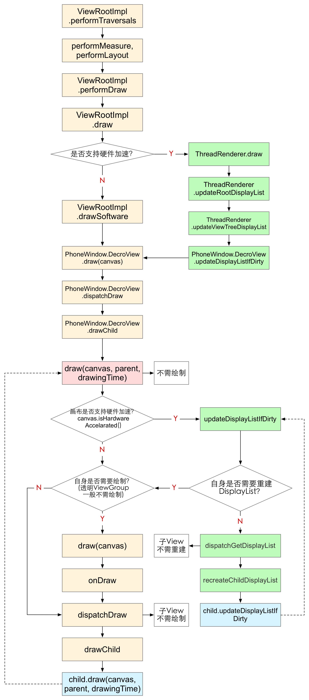

在Android平台的演变过程中，也有针对图形渲染方面的改进：
1. Android 3.0 Honeycomd 中，引入了硬件加速。
2. Android 4.0 Ice Cream Sandwich 中，默认开启硬件加速。

随着平台带来的这个变化，视图以及所有的Canvas对象的绘制操作，原本由CPU来完成，现在都交由GPU来完成。

硬件加速的主要原理，**就是通过底层软件代码，将CPU不擅长的图形计算转换成GPU专用指令，转由GPU完成。**


原先基于软件的绘制模型主要由以下两步构成：
1. **Invalidation:** 当视图层级需要更新，或者只是 View 的一个属性发生变化，View.invalidata() 方法就会被调用，该方法会传播到整个视图层级，使得整个视图层级被重绘。
2. **Redrawing:** 每个 View 在重绘时，都会消耗大量的CPU性能。

```
不幸的是，基于这个绘制模型有两个缺点：
1. 首先，这个模型需要在每个绘图过程中执行大量代码。例如，如果您的应用程序界面中有一个按钮，并且该按钮位于另一个视图的顶部，调用按钮的invalidate()方法，则Android系统会重新绘制整个视图（包括按钮下面的另一个视图），即使它没有更改。
2. 第二个问题是绘图模型可以隐藏应用程序中的错误。由于Android系统在与脏区域相交时重绘视图，因此即使invalidate()方法没有在脏区域上调用，也可能会重绘它。发生这种情况时，我们是依赖于另一个视图触发了 invalidate()方法以获得正确的行为。因此，每当修改影响视图绘图代码的数据或状态时，应始终在自定义视图上调用invalidate()。
```

**PS**：
通常情况下的软件绘制刷新逻辑简介:
- 默认情况下，`View`的`clipChildren`属性为`true`，即每个`View`绘制区域不能超出其父`View`的范围。如果设置一个页面根布局的`clipChildren`属性为`false`，则子`View`可以超出父`View`的绘制区域。

- 当一个`View`触发`invalidate`，且没有播放动画、没有触发`layout`的情况下：
    - 对于全不透明的`View`，其自身会设置标志位`PFLAG_DIRTY`，其父`View`会设置标志位`PFLAG_DIRTY_OPAQUE`。在`draw(canvas)`方法中，只有这个`View`自身重绘。
    
    - 对于可能有透明区域的`View`，其自身和父`View`都会设置标志位`PFLAG_DIRTY`。
        - `clipChildren`为`true`时，脏区会被转换成`ViewRoot`中的`Rect`，刷新时层层向下判断，当`View`与脏区有重叠则重绘。如果一个`View`超出父`View`范围且与脏区重叠，但其父`View`不与脏区重叠，这个子`View`不会重绘。
        
        - `clipChildren`为`false`时，`ViewGroup.invalidateChildInParent()`中会把脏区扩大到自身整个区域，于是与这个区域重叠的所有View都会重绘。*

经过测试，上面的刷新逻辑是对的，当开启硬件加速的时候，只有Button刷新，当关闭硬件加速的时候，如果Button不透明，**不会**引起LinearLayout的刷新，当Button透明，**会**引起LinearLayout的刷新。

随着全新硬件加速绘制模型的引入，重绘并不会立即执行，因为View被存储起来了。所以步骤变成这样：
1. **Invalidate:** 与软件绘制模型一样。
2. **Storing：**在这种情况下，只有需要被更新的视图才进行重绘，并且在重绘之后被存储起来，以便重用，从而减少运行时的计算量。
3. **Redrawing:** 每个View利用之前存储下来的`绘图`进行更新，也就是说，那些不需要被更新的View，可以通过上次被储存下来的`绘图`进行更新（注：绘图这个词可能描述的并不准确，希望自行体会）。

通过上面的介绍，开发者应该能有一个大致的了解，现在截取美团基于Android 6.0的绘制流程分析来具体的讲解硬件加速做了什么。

下面是安卓View完整的绘制流程图，主要通过阅读源码和调试得出，虚线箭头表示递归调用。

- 从`ViewRootImpl.performTraversals`到`PhoneWindow.DecroView.drawChild`是每次遍历`View`树的固定流程，首先根据标志位判断是否需要重新布局并执行布局；然后进行`Canvas`的创建等操作开始绘制。

    - 如果硬件加速不支持或者被关闭，则使用软件绘制，生成的`Canvas`即`Canvas.class`的对象；
    - 如果支持硬件加速，则生成的是`DisplayListCanvas.class`的对象；
    - 两者的`isHardwareAccelerated()`方法返回的值分别为`false`、`true`，`View`根据这个值判断是否使用硬件加速。
    

- `View`中的`draw(canvas,parent,drawingTime) - draw(canvas) - onDraw - dispachDraw - drawChild`这条递归路径（下文简称`Draw`路径），调用了`Canvas.drawXxx()`方法，在软件渲染时用于实际绘制；在硬件加速时，用于构建`DisplayList`。

- `View`中的`updateDisplayListIfDirty - dispatchGetDisplayList - recreateChildDisplayList`这条递归路径（下文简称`DisplayList`路径），仅在硬件加速时会经过，用于在遍历`View`树绘制的过程中更新`DisplayList`属性，并快速跳过不需要重建`DisplayList`的`View`。

    - `Android 6.0`中，和`DisplayList`相关的`API`目前仍被标记为`“@hide”`不可访问，表示还不成熟，后续版本可能开放。

- 硬件加速情况下，`draw`流程执行结束后`DisplayList`构建完成，然后通过`ThreadedRenderer.nSyncAndDrawFrame()`利用`GPU`绘制`DisplayList`到屏幕上。





硬件加速相关的内容就介绍完了，这里做个简单总结：

1. CPU更擅长复杂逻辑控制，而GPU得益于大量ALU和并行结构设计，更擅长数学运算。
2. 页面由各种基础元素（DisplayList）构成，渲染时需要进行大量浮点运算。
3. 硬件加速条件下，CPU用于控制复杂绘制逻辑、构建或更新DisplayList；GPU用于完成图形计算、渲染DisplayList。
4. 硬件加速条件下，刷新界面尤其是播放动画时，CPU只重建或更新必要的DisplayList，进一步提高渲染效率。
5. 实现同样效果，应尽量使用更简单的DisplayList，从而达到更好的性能（Shape代替Bitmap等）。


**离屏缓冲**

每个View都能被渲染并保存为一个离屏位图，以供未来使用。首先通过调用Canvas.saveLayer()方法，渲染并保存位图，接着通过Canvas.restore()方法将说保存的位图绘制回画布。这些操作需要谨慎自行，因为绘制一个不需要的离屏位图同样需要消耗计算量。

上面我们说了硬件加速，但是不是所有的操作都支持硬件加速，如果你的绘制操作不支持硬件加速，你需要手动关闭硬件加速来绘制界面，关闭的方式是通过这行代码：
```java
view.setLayerType(LAYER_TYPE_SOFTWARE, null);  
```

下面再截取Hencoder关于离屏缓冲的讲解：
有不少人都有过疑问：什么是 `layer type`？如果这个方法是硬件加速的开关，那么它的参数为什么不是一个  `LAYER_TYPE_SOFTWARE` 来关闭硬件加速以及一个 `LAYER_TYPE_HARDWARE` 来打开硬件加速这么两个参数，而是三个参数，在 `SOFTWARE` 和 `HARDWARE` 之外还有一个 `LAYER_TYPE_NONE`？难道还能既不用软件绘制，也不用硬件绘制吗？

事实上，这个方法的本来作用并不是用来开关硬件加速的，只是当它的参数为 `LAYER_TYPE_SOFTWARE` 的时候，可以「顺便」把硬件加速关掉而已；并且除了这个方法之外，`Android` 并没有提供专门的 `View` 级别的硬件加速开关，所以它就「顺便」成了一个开关硬件加速的方法。

`setLayerType()` 这个方法，它的作用其实就是名字里的意思：设置 `View Layer` 的类型。所谓 `View Layer`，又称为离屏缓冲（Off-screen Buffer），它的作用是单独启用一块地方来绘制这个 `View` ，而**不是**使用软件绘制的 `Bitmap` 或者通过硬件加速的 `GPU`。这块「地方」可能是一块单独的 `Bitmap`，也可能是一块 `OpenGL` 的纹理（texture，OpenGL 的纹理可以简单理解为图像的意思），具体取决于硬件加速是否开启。采用什么来绘制 `View` 不是关键，关键在于当设置了 `View Layer` 的时候，它的绘制会被缓存下来，而且缓存的是最终的绘制结果，而不是像硬件加速那样只是把 `GPU` 的操作保存下来再交给 `GPU` 去计算。通过这样更进一步的缓存方式，`View` 的重绘效率进一步提高了：只要绘制的内容没有变，那么不论是 `CPU` 绘制还是 `GPU` 绘制，它们都不用重新计算，而只要只用之前缓存的绘制结果就可以了。

基于这样的原理，在进行移动、旋转等（无需调用 `invalidate()`）的属性动画的时候开启 `Hardware Layer` 将会极大地提升动画的效率，因为在动画过程中 `View` 本身并没有发生改变，只是它的位置或角度改变了，而这种改变是可以由 `GPU` 通过简单计算就完成的，并不需要重绘整个 `View`。所以在这种动画的过程中开启 `Hardware Layer`，可以让本来就依靠硬件加速而变流畅了的动画变得更加流畅。实现方式大概是这样：

```java
view.setLayerType(LAYER_TYPE_HARDWARE, null);  
ObjectAnimator animator = ObjectAnimator.ofFloat(view, "rotationY", 180);

animator.addListener(new AnimatorListenerAdapter() {  
    @Override
    public void onAnimationEnd(Animator animation) {
        view.setLayerType(LAYER_TYPE_NONE, null);
    }
});

animator.start(); 
```
或者如果是使用 ViewPropertyAnimator，那么更简单：
```java
// withLayer() 可以自动完成上面这段代码的复杂操作
view.animate()  
        .rotationY(90)
        .withLayer(); 
```
不过一定要注意，只有你在对 `translationX` `translationY` `rotation` `alpha` 等无需调用 `invalidate()` 的属性做动画的时候，这种方法才适用，因为这种方法本身利用的就是当界面不发生改变时，缓存未更新所带来的时间的节省。所以简单地说——**这种方式不适用于基于自定义属性绘制的动画**，一定记得这句话。

由于设置了 `View Layer` 后，`View` 在初次绘制时以及每次 `invalidate()` 后重绘时，需要进行两次的绘制工作（一次绘制到 `Layer`，一次从 `Layer` 绘制到显示屏），所以其实它的每次绘制的效率是被降低了的。所以一定要慎重使用 `View Layer`，在需要用到它的时候再去使用。

PS:
每当你要让View执行一个Alpha动画，或者仅仅只是对其设置一个不同的Alpha值时，都可以考虑使用View.LAYER_TYPE_HARDWARE。这点非常重要，以至于Google改写了View.setAlpha()方法，从Android 6.0 开始，自动应用硬件层。所以，如果你的应用程序目标SDK大于等于23的话，就没有必要这样做了。

最后，希望开发者能理解，硬件加速与离屏缓冲他们不是同一个东西，但是在API上又有一定的联系。两者都能加快渲染速度，一个缓存的是绘制操作，减少计算量，一个缓存的是绘制结果，只用绘制一次。同时开始硬件加速与硬件离屏缓存就能达到最好的效果，当然要注意View的内容不能改变。


**参考文档：**
1. https://www.mtyun.com/library/hardware-accelerate
2. https://hencoder.com/ui-1-8/
3. https://juejin.im/post/5a1f7b3e6fb9a0451b0451bb
4. https://developer.android.com/guide/topics/graphics/hardware-accel


