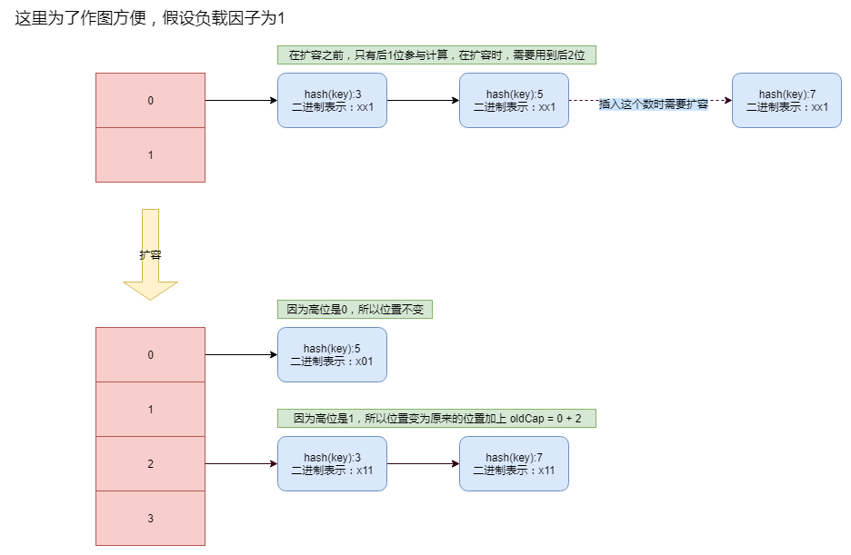

## 寻找储存的位置
将一个键值对放到HashMap里面的时候，需要计算这个键值对存放到哪个位置，该位置的计算方式如下：
- 计算 key 的 hashCode
    ```java
        // 使用 key 的 hashCode 方法来计算
        static final int hash(Object key) {
            int h;
            // 当key = null时，hash值 = 0，所以HashMap的key 可为null      
            // 注：对比HashTable，HashTable对key直接hashCode（），若key为null时，会抛出异常，所以HashTable的key不可为null
            return (key == null) ? 0 : (h = key.hashCode()) ^ (h >>> 16);
        }
    ```

- 根据容量大小与key的hashCode来算出位置
    ```java
    // 这里 i 就是计算出来的位置，hash 就是上面 hash() 函数返回的值。
    i = (n - 1) & hash
    ```
**代码解析：**
因为 n 始终是2的幂次方，所以结果就是 hash & （二进制位数全部为1的数），效果就相当于截取hash的最后几位，如果n=32，那么就是截取最后5位。

唯一的疑问就是为什么要将 key 的 hashCode 异或自己的高16位？其实计算hashCode的那段代码叫“**扰动函数**”。那它有什么作用呢？

假设我们没有这段代码，直接使用 key 的 hashCode 来计算 table 中的位置，由于 key 可以是任意对象，这里再次假设它是一个自定义的对象，并且它的 hashCode 方法实现的非常糟糕，如下：
```java
int hashCode() {
    return i << 4;
}
```
可以看出来，无论i的值是多少，计算出来的 hashCode 的值，它的低 4 位全是 0 。那么使用这个 hashCode 去计算 table 的位置会发生什么呢？我们先认为这个HashMap 的容量是默认的 16，那么使用上面的 hashCode 计算出来的结果就全部是 0，所有的数据都会放在同一个位置，那么散列表就变成了链表。


可以看到，无论 hashCode 的高位是多少，& 计算出来的结果，全都是0，所以就会导致非常高的碰撞几率。

其实，这都由于只取了散列值的最后几位引起的，就算散列值分布再松散，要是只取最后几位的话，碰撞也会很严重。更要命的是如果散列本身做得不好，分布上成等差数列的漏洞，恰好使最后几个低位呈现规律性重复，就无比蛋疼。

那么为了减少这种情况，扰动函数的作用就出来了，就是让 hashCode 的每一位都参与的计算中去，使用异或的方式，让结果保留一点高位的影子，这样它的低位值就是随机的了，即使 key 的 hashCode 实现的很糟糕。

## 2次方与扩容
- **为什么HashMap的容量要设计成2的幂次方呢？**
    默认情况下HashMap的容量是16，但是，如果用户通过构造函数指定了一个数字作为容量，那么HashMap会选择大于该数字的第一个2的幂作为容量。(3->4、7->8、9->16)

    将容量设计为2的幂次方时，计算位置时，`(n-1)&hash 相当于 hash%n`，而计算机里面位运算是基本运算，位运算的效率是远远高于取余%运算的。这是第一个考虑，还有一个好处，后面再说。
    
- **容量初始化算法**
    
    ```java
        /**
         * Returns a power of two size for the given target capacity.
         */
        static final int tableSizeFor(int cap) {
            int n = cap - 1;
            // 左移1位，第一个为1的位的后面的位也变成了1，就有了两个连续的1
            n |= n >>> 1;
            // 因为有两个为1的位，所以左移2位，将那两个连续的1扩展为4个连续的1
            n |= n >>> 2;
            // 扩展为 8 位
            n |= n >>> 4;
            // 扩展为 16 位
            n |= n >>> 8;
            // 扩展为 32 位，正所谓星星之火可以燎原。
            n |= n >>> 16;
            return (n < 0) ? 1 : (n >= MAXIMUM_CAPACITY) ? MAXIMUM_CAPACITY : n + 1;
        }
    ```
    这里其实是很简单的一个思想：**对于一个数字的二进制，从第一个不为0的位开始，把后面的所有位都设置成1**。比如说一个数为1000,0000,0000，它的变化过程如下：
    ```console
    1000,0000,0000
    1100,0000,0000
    1111,0000,0000
    1111,1111,0000
    1111,1111,1111
    ```
    
    
- 扩容的小技巧

    扩容每次都是在原来的基础上变为2倍，这个比较简单，需要注意的是一个叫做**负载因子**的东西。HashMap扩容时，并不是装满容量了之后才扩容，而是有一个阈值：`容量的大小 * 负载因子`。那么负载因子的取值会有什么影响呢？
    
    
    
    上面说了这么多，都不是我们的目标，我们这次的目的是探究一下，每一个entry里面的元素是扩容之后是如何分配的？这要从hash碰撞说起。

    无论Hash函数设计的多么精妙，总免不了hash碰撞，所以HashMap的结构才是数组加上链表加上红黑树，我们现在探究的就是如果一个entry是链表的时候，这个entry里面的数据是如何分配到扩容之后的HashMap中的。
    
    看看源码的算法：
    ```java
    final Node<K,V>[] resize() {
        ...
        Node<K,V> loHead = null, loTail = null;
        Node<K,V> hiHead = null, hiTail = null;
        Node<K,V> next;
        do {
            next = e.next;
            // 注意：不是(e.hash & (oldCap-1));而是(e.hash & oldCap)
            // (e.hash & oldCap) 得到的是元素的在数组中的位置是否需要移动
            // 这里是一个非常巧妙的地方，计算位置用的是 e.hash & oldCap -1
            // oldCap -1 的二进制位全部位1，比如32：1,1111，有5位
            // oldCap 的二进制位只有第一位为1，后面的全部为0，比如32：10,0000，有6位
            // 所以利用高出来的一位来计算新数组中的位置（这样就可以认为是随机分散的）
            if ((e.hash & oldCap) == 0) {
                if (loTail == null)
                    loHead = e;
                else
                    loTail.next = e;
                loTail = e;
            }
            else {
                if (hiTail == null)
                    hiHead = e;
                else
                    hiTail.next = e;
                hiTail = e;
            }
        } while ((e = next) != null);
        // 高位为0，则位置不变
        if (loTail != null) {
            loTail.next = null;
            newTab[j] = loHead;
        }
        // 高位为1，则位置变化
        if (hiTail != null) {
            hiTail.next = null;
            newTab[j + oldCap] = hiHead;
        }
        ...
    }
    ```
    这是JDK1.8的算法，e就是entry的头节点。可以看出来，它将原来的一个链表分成了两个链表loHead与hiHead，分割的条件就是`(e.hash & oldCap) == 0`，e的hash其实就是上面分析的hash函数的值。因为代码中给了详尽的注释，所以这里不在赘述这行代码的意思。
    
    容量为2的幂次方的第二个好处在`newTab[j + oldCap] = hiHead;`这行代码里面体现了出来，计算新的位置时，只需要在原来的基础上加上oldCap就行了。由于新分配的空间是原来的2倍，所以有一般还没有利用起来，这个时候，随机的（因为不知道hash值的高位是0还是1，所以可以认为是随机的）将原来的entry分为2个，一个放在原位置，一个放在新分配的位置，就完美的分散了原来的数据，并且将新的空间利用了起来。
    
    上图说话：
    
    

## 初始化时，强烈建议给定容量大小
- 这个容量如何确定呢？
在《阿里巴巴Java开发手册》有以下建议：
initialCapacity = (需要储存的元素个数 / 负载因子) + 1。负载因子默认是0.75，如果实在是无法确定大小，可以给出默认值16。

- 为何需要给定大小？
是因为如果需要put的数据非常多，而默认值是16的话，就需要进行很多次扩容操作，而扩容操作需要先申请新的内存，将原数据copy过去，再分配，比较耗时。

## 参考文档
- https://blog.csdn.net/carson_ho/article/details/79373134
- https://www.zhihu.com/question/20733617
- http://www.hollischuang.com/archives/2431
- https://blog.csdn.net/u013494765/article/details/77837338
- https://blog.csdn.net/witsmakemen/article/details/78820410