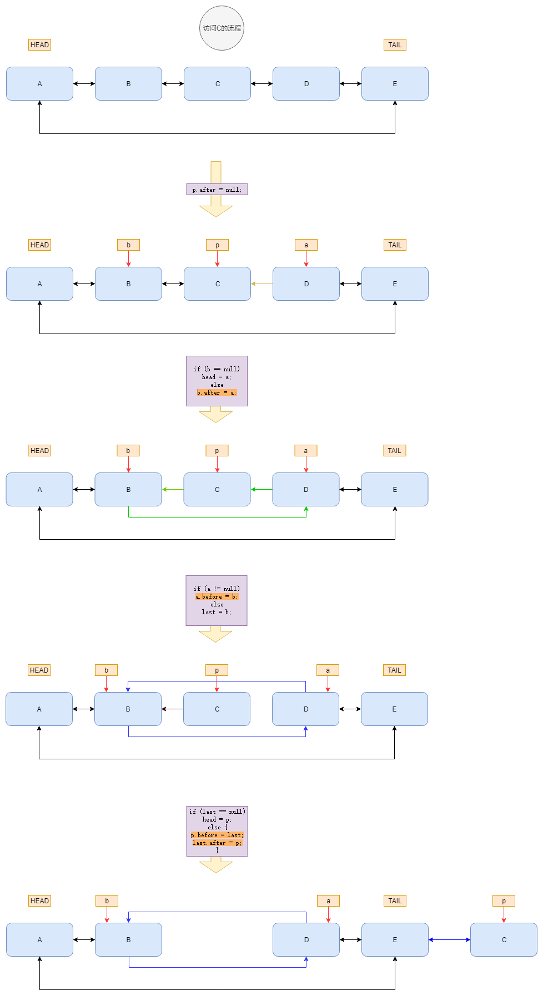
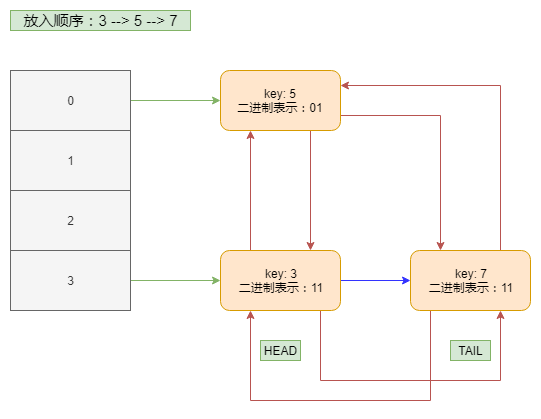
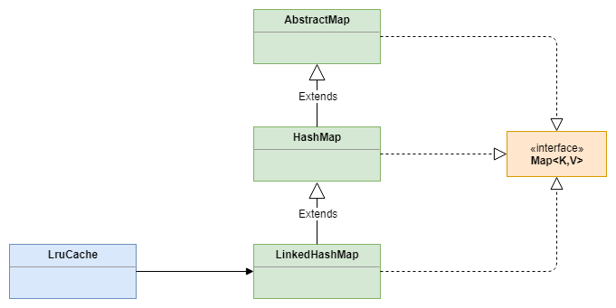
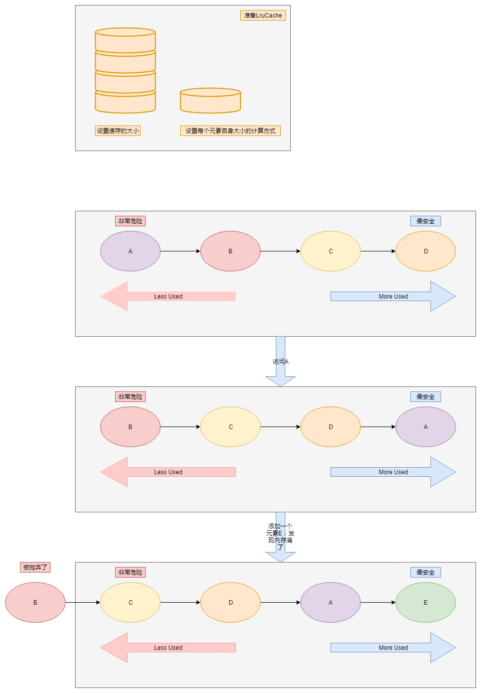

## 与HashMap的关系
```java?linenums
public class LinkedHashMap<K,V> extends HashMap<K,V> implements Map<K,V> {
    ...
}
```

## accessOrder 字段

```java?linenums
    /**
     * The iteration ordering method for this linked hash map: <tt>true</tt>
     * for access-order, <tt>false</tt> for insertion-order.
     *
     * @serial
     */
    final boolean accessOrder;
```
当这个字段为true的时候，迭代器的顺序是按照访问的顺序来输出的，为false的时候，是按照插入的顺序来输出的。

看几个例子：
- **当使用默认的构造函数，accessOrder为false**
    ```java?linenums
    public static void main(String[] args) {
            LinkedHashMap<Integer, Integer> map = new LinkedHashMap<Integer, Integer>();
            for (int i = 0; i < 10; i++) {//按顺序放入0~9
                map.put(i, i);
            }
            System.out.println("原数据："+map.toString());
            map.get(3);
            System.out.println("查询存在的某一个："+map.toString());
            map.put(4, 4);
            System.out.println("插入已存在的某一个："+map.toString()); //直接调用已存在的toString方法，不然自己需要用迭代器实现
            map.put(10, 10);
            System.out.println("插入一个原本没存在的："+map.toString());
        }
    ```
    **输出**：
    ```console?linenums
    //  输出结果
    //  原数据：{0=0, 1=1, 2=2, 3=3, 4=4, 5=5, 6=6, 7=7, 8=8, 9=9}
    //  查询存在的某一个：{0=0, 1=1, 2=2, 3=3, 4=4, 5=5, 6=6, 7=7, 8=8, 9=9}
    //  插入已存在的某一个：{0=0, 1=1, 2=2, 3=3, 4=4, 5=5, 6=6, 7=7, 8=8, 9=9}
    //  插入一个原本没存在的：{0=0, 1=1, 2=2, 3=3, 4=4, 5=5, 6=6, 7=7, 8=8, 9=9, 10=10}
    ```
    
    
- **使用带参数的构造函数**

    ```java
    public static void main(String[] args) {
        LinkedHashMap<Integer, Integer> map = new LinkedHashMap<Integer, Integer>(20, 0.75f, true);
        for (int i = 0; i < 10; i++) {//按顺序放入1~9
            map.put(i, i);
        }
        System.out.println("原数据："+map.toString());
        map.get(3);
        System.out.println("查询存在的某一个："+map.toString());
        map.put(4, 4);
        System.out.println("插入已存在的某一个："+map.toString()); //直接调用已存在的toString方法，不然自己需要用迭代器实现
        map.put(10, 10);
        System.out.println("插入一个原本没存在的："+map.toString());
    }
    ```
    
    **输出**：
    ```java
    //  输出结果
    //  原数据：{0=0, 1=1, 2=2, 3=3, 4=4, 5=5, 6=6, 7=7, 8=8, 9=9}
    //  查询存在的某一个：{0=0, 1=1, 2=2, 4=4, 5=5, 6=6, 7=7, 8=8, 9=9, 3=3}，被访问（get）的3放到了最后面
    //  插入已存在的某一个：{0=0, 1=1, 2=2, 5=5, 6=6, 7=7, 8=8, 9=9, 3=3, 4=4}，被访问（put）的4放到了最后面
    //  插入一个原本没存在的：{0=0, 1=1, 2=2, 5=5, 6=6, 7=7, 8=8, 9=9, 3=3, 4=4, 10=10}，新增一个放到最后面
    ```
    
迭代顺序正如注释所说。那么为何会这样呢？让我们慢慢来揭开LinkedHashMap神秘的面纱。

## 头尾指针

```java?linenums
    /**
     * The head (eldest) of the doubly linked list.
     */
    transient LinkedHashMapEntry<K,V> head;

    /**
     * The tail (youngest) of the doubly linked list.
     */
    transient LinkedHashMapEntry<K,V> tail;
```

head是双链表的头节点，tail自然是双链表的尾节点。那么这两个变量有什么用呢？他们与accesOrder有啥关系？

我们先来分析，上面例子的行为。在第二个例子中，设置了 accessOrder 为 true，当我们调用 get() 方法之后，发现被访问的那个元素移动到了最后面。顺着get()方法来分析，为何为出现这种情况。

```java
    public V get(Object key) {
        Node<K,V> e;
        if ((e = getNode(hash(key), key)) == null)
            return null;
        if (accessOrder)
            afterNodeAccess(e);
        return e.value;
    }
```
getNode 是父类的方法，没有什么可以说的，值得深入的地方是最后的那个判断语句
```java
    if (accessOrder)
        afterNodeAccess(e);
```
只有 accessOrder 为 true 的时候，才会执行 afterNodeAccess 这个判断似乎比较符合上面的行为。看来一切玄机都在这个方法里面。

```java
    void afterNodeAccess(Node<K,V> e) { // move node to last
        LinkedHashMapEntry<K,V> last;
        if (accessOrder && (last = tail) != e) {
            LinkedHashMapEntry<K,V> p =
                (LinkedHashMapEntry<K,V>)e, b = p.before, a = p.after;
            p.after = null;
            if (b == null)
                head = a;
            else
                b.after = a;
            if (a != null)
                a.before = b;
            else
                last = b;
            if (last == null)
                head = p;
            else {
                p.before = last;
                last.after = p;
            }
            tail = p;
            ++modCount;
        }
    }
```
方法名后面的注释解释了这个方法的作用：将参数节点移动到双向链表的最后面去，即让 tail 节点指向 e。
下面用一幅图来解释这个方法运作的原理：



如此这般，就将访问的节点e，移动到了双链表的尾节点。

同样的，我们在看看put()方法，由于LinkedHashMap没有覆盖put()方法，我们就去HashMap的源码中找找源头：
```java
            if (e != null) { // existing mapping for key
                V oldValue = e.value;
                if (!onlyIfAbsent || oldValue == null)
                    e.value = value;
                afterNodeAccess(e);
                return oldValue;
            }
```
这里有个陷阱，你突然猛地一看，感觉是那么回事，调用了 afterNodeAccess 方法，但是调用这个方法的前提条件是 e != null，用普通话说就是 如果key已经在map里面存在的时候，才会调用这个方法，那么当 e == null 的时候呢，源码里面调用了 newNode 方法：
```java
// tab[i] 为null的时候
tab[i] = newNode(hash, key, value, null);

// 红黑树上添加一个
TreeNode<K,V> x = map.newTreeNode(h, k, v, xpn);

// 链表上添加一个
p.next = newNode(hash, key, value, null);
```
这里又有一个坑，当我天真的查看 newNode 与 newTreeNode 的时候，发现根本就只是调用了一个构造方法，突然就懵逼了，这根本说不通啊，按照之前的例子的行为，每次添加一个新的元素，也应该要放到双链表的最后才对。在我翻了几篇博客的时候突然想到，这两个方法会不会被LinkedHashMap重写了，查看源码，果然：
```java
    Node<K,V> newNode(int hash, K key, V value, Node<K,V> e) {
        LinkedHashMapEntry<K,V> p =
            new LinkedHashMapEntry<K,V>(hash, key, value, e);
        linkNodeLast(p);
        return p;
    }
```

```java
    TreeNode<K,V> newTreeNode(int hash, K key, V value, Node<K,V> next) {
        TreeNode<K,V> p = new TreeNode<K,V>(hash, key, value, next);
        linkNodeLast(p);
        return p;
    }
```
这两个货都调用了 linkNodeLast 方法，这个方法看名字就知道是将节点放到最后面，虽然它没有调用 afterNodeAccess，但是他们的作用确是一样的。
```java
    // link at the end of list
    private void linkNodeLast(LinkedHashMapEntry<K,V> p) {
        LinkedHashMapEntry<K,V> last = tail;
        tail = p;
        if (last == null)
            head = p;
        else {
            p.before = last;
            last.after = p;
        }
    }
```
这个很简单，就不多说了。稍微提一下，按照源码的逻辑，每次新增的元素都是放在迭代器最后的，无论有没有开启 accessOrder，因为这里没有判断 accessOrder 字段，可以写demo验证一下。

还有一个忽略的地方，就是 LinkedHashMapEntry 这个 Entry 里面有两个变量 before，after，他们是前后指针，有了他们才能形成双链表。

## LinkedHashMap的结构

上面也说到过，LinkedHashMap是继承HashMap的，所以底层的数据结构与HashMap一样，不过它有自己的成员变量：head与tail。也就是说它增强了HashMap，在HashMap的基础上又维护了一个双链表。上图便于理解：



红色的箭头就是LinkedHashMap自己维护的双链表，其他的还是HashMap自己的东西。

## LruCache 原理

LruCache 解释：LRU是Least Recently Used的缩写，即最近最少使用。

**为什么会有这个算法？**

LRU算法的提出，是基于这样一个事实：之前使用过的数据，很可能在后面会频繁的使用到。反过来说，已经很久没有使用的数据很可能在未来较长的一段时间内不会被用到。这个，就是著名的局部性原理。因此，我们只需要在每次缓存满了的时候，移除最长时间没有使用的元素就好了。

其实看了这段解释，你应该能够想到LinkedHashMap，因为这个货设置 accessOrder 为 true的时候，每次都会将访问的元素放在双链表的最后面，那么当存放的数据满了之后，我们只需要移除head指向的元素就好了，这样的行为非常符合Lru的原理。

先上类图，搞清楚关系：



根据类图可以看出一个大概，LruCache的核心还是利用LinkedHashMap来实现的。LruCache的代码并不多，而且不难，300行不到，我们一点一点来看。

### LruCache 构造函数

```java
    /**
     * @param maxSize for caches that do not override {@link #sizeOf}, this is
     *     the maximum number of entries in the cache. For all other caches,
     *     this is the maximum sum of the sizes of the entries in this cache.
     */
    public LruCache(int maxSize) {
        if (maxSize <= 0) {
            throw new IllegalArgumentException("maxSize <= 0");
        }
        this.maxSize = maxSize;
        this.map = new LinkedHashMap<K, V>(0, 0.75f, true);
    }
```
look，它将 accessOrder 字段设置为 true，负载因子使用推荐（默认）的0.75。

### LruCache get 方法

```java
    /**
     * Returns the value for {@code key} if it exists in the cache or can be
     * created by {@code #create}. If a value was returned, it is moved to the
     * head of the queue. This returns null if a value is not cached and cannot
     * be created.
     */
    public final V get(K key) {
        if (key == null) {
            throw new NullPointerException("key == null");
        }

        V mapValue;
        // 统计 hitCount 与 missCount
        synchronized (this) {
            mapValue = map.get(key);
            if (mapValue != null) {
                hitCount++;
                return mapValue;
            }
            missCount++;
        }

        /*
         * Attempt to create a value. This may take a long time, and the map
         * may be different when create() returns. If a conflicting value was
         * added to the map while create() was working, we leave that value in
         * the map and release the created value.
         */
        // 如果key值不存在与map中，那么调用 create 方法创建一个，注意这个方法没有同步
        V createdValue = create(key);
        // create 方法默认返回 
        if (createdValue == null) {
            return null;
        }

        // 
        synchronized (this) {
            createCount++;
            // 将创建的值放入map中，如果map在前面的过程中有别的线程放入了这对key-value，那么会返回放入的value
            mapValue = map.put(key, createdValue);
            // 不为空，说明不需要我们所创建的值，所以又把返回的值放进去
            // 将新创建的值丢弃
            if (mapValue != null) {
                // There was a conflict so undo that last put
                map.put(key, mapValue);
            } else {
                //为空，说明我们更新了这个key的值，需要重新计算大小
                size += safeSizeOf(key, createdValue);
            }
        }

        if (mapValue != null) {
            // 通知创建的值需要被移除，已经有别的线程创建了对应的key-value
            entryRemoved(false, key, createdValue, mapValue);
            return mapValue;
        } else {
            // 没有冲突时，因为放入了新创建的值，大小已经有变化，所以需要修整大小
            trimToSize(maxSize);
            return createdValue;
        }
    }
```
本来是不想贴代码的，因为贴了之后自己记不住，别人也懒得看，但是这个类确实很简单，自己看看就明白了。不帖代码也不知道该怎么写。

## LruCache put 方法

```java
    public final V put(K key, V value) {
        if (key == null || value == null) {
            throw new NullPointerException("key == null || value == null");
        }

        V previous;
        synchronized (this) {
            putCount++;
            // 计算该 value 占用的缓存大小
            size += safeSizeOf(key, value);
            previous = map.put(key, value);
            // 如果 key 存在，总的大小需要减去key对应的旧value的大小
            if (previous != null) {
                size -= safeSizeOf(key, previous);
            }
        }
        // 调用钩子函数
        if (previous != null) {
            entryRemoved(false, key, previous, value);
        }
        // 查看是否需要释放缓存空间
        trimToSize(maxSize);
        return previous;
    }
```

## LruCache trimToSize 方法

```java
private void trimToSize(int maxSize) {
        while (true) {
            K key;
            V value;
            synchronized (this) {
                if (size < 0 || (map.isEmpty() && size != 0)) {
                    throw new IllegalStateException(getClass().getName()
                            + ".sizeOf() is reporting inconsistent results!");
                }

                if (size <= maxSize) {
                    break;
                }

                // BEGIN LAYOUTLIB CHANGE
                // get the last item in the linked list.
                // This is not efficient, the goal here is to minimize the changes
                // compared to the platform version.
                Map.Entry<K, V> toEvict = null;
                for (Map.Entry<K, V> entry : map.entrySet()) {
                    toEvict = entry;
                }
                // END LAYOUTLIB CHANGE

                if (toEvict == null) {
                    break;
                }

                key = toEvict.getKey();
                value = toEvict.getValue();
                map.remove(key);
                size -= safeSizeOf(key, value);
                evictionCount++;
            }

            entryRemoved(true, key, value, null);
        }
    }
```
看起来很长，但是其实就是不断的删除Head节点，直到缓存大小小于我们设置的最大缓存大小。没啥说的。

## LruCahe 使用例子

```java
            mMemoryCache = new LruCache<String, BitmapDrawable>(mCacheParams.memCacheSize) {
                /**
                 * Notify the removed entry that is no longer being cached
                 */
                @Override
                protected void entryRemoved(boolean evicted, String key,
                        BitmapDrawable oldValue, BitmapDrawable newValue) {
                    if (RecyclingBitmapDrawable.class.isInstance(oldValue)) {
                        // The removed entry is a recycling drawable, so notify it
                        // that it has been removed from the memory cache
                        ((RecyclingBitmapDrawable) oldValue).setIsCached(false);
                    } else {
                        // The removed entry is a standard BitmapDrawable
                        if (Utils.hasHoneycomb()) {
                            // We're running on Honeycomb or later, so add the bitmap
                            // to a SoftReference set for possible use with inBitmap later
                            mReusableBitmaps.add(new SoftReference<Bitmap>(oldValue.getBitmap()));
                        }
                    }
                }
                /**
                 * Measure item size in kilobytes rather than units which is more practical
                 * for a bitmap cache
                 */
                @Override
                protected int sizeOf(String key, BitmapDrawable value) {
                    final int bitmapSize = getBitmapSize(value) / 1024;
                    return bitmapSize == 0 ? 1 : bitmapSize;
                }
            };
        }
```

上面的代码是Google很老的例子，因为Lru使用很简单，所以仍然用这个说明一下。

构造函数传递一个值，是用来限制缓存的大小的，比如你存放 bitmap，那么就需要根据App的可用内存来动态计算这个缓存应该占据多少。

entryRemoved 就是当资源被回收是会自动回调的一个钩子函数，如果你的缓存里面存放的资源被回收时，你还需要做一些别的操作，那么你需要实现这个方法。举个不恰当的例子，你想缓存一些连接，那么当这个连接被移除的时候，你肯定需要关闭这个连接，这个时候，在 entryRemoved 里面关闭就很容易了。

sizeOf 就是用来计算每个元素占用空间的大小。比如，图片一般的计算方式是计算图片被读取到内存中的大小，但是有时候可能产品脑子被驴踢了（不恰当的例子），它就要缓存固定个数的图片，不论图片大小，这个时候，sizeOf 就需要返回 1，只有这样才能满足要求。

## LruCache 工作流程图



## 参考

- https://blog.csdn.net/maosidiaoxian/article/details/51393753