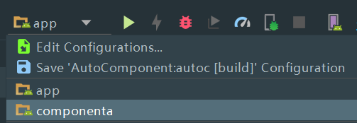
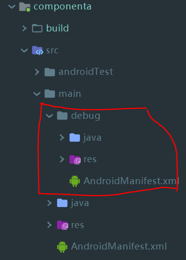

### 目的
- 该插件基于三方开源库编写而来，主要用于简化组件化工程的框架搭建。

- 该插件不包含组件之间的通信方案，目前组件通信方案有多种选择，该插件不会与任何通讯方案冲突，可以自由组合。

### 优点
1. 避免组件在Application与Library之间切换。如下例子：




在上图中，app是主工程，componenta是组件。点击comonenta或者app均可以单独运行。但是与普通项目不同的是**点击app运行的时候，会将componenta当作一个library打到app里面去**。


2. 统一debug文件的位置，一目了然，如下：



3. 避免每个组件都要配置sourceSet，使用该插件之后，gradle中不用设置任何额外的东西，插件会自动管理。
4. 优秀的提示语句


### 快速使用

- 在Project的build.gradle中配置：
    ```gradle
    
        repositories {
            maven {
                url  "https://dl.bintray.com/aprz512/gradle_plugins" 
            }
        }
    
        dependencies {
            classpath 'com.aprz.module.manager:autoc:1.5.0'
        }
    
    ```

- 在主工程的build.gradle中配置：
    ```gradle
    ext.mainApp = true
    apply plugin: 'aprz.manager'
    
    // 删除下面的语句，已经不需要了，插件会自动判断是否应该添加
    // apply plugin: 'com.android.application'
    
    // 添加组件使用如下语句：addComponent '组件名'
    addComponent 'componenta'
    
    ```

- 在组件工程中配置：
    ```gradle
    apply plugin: 'aprz.manager'
    // 删除下面的语句，已经不需要了，插件会自动判断是否应该添加
    // apply plugin: 'com.android.library'
    ```

- 在local.properties中设置
    ```cmd
    // 表示当前组件不参与打包
    componenta = true
    ```


现在组件化工程就已经搭建好了，当然你还需要选择组件通信框架。